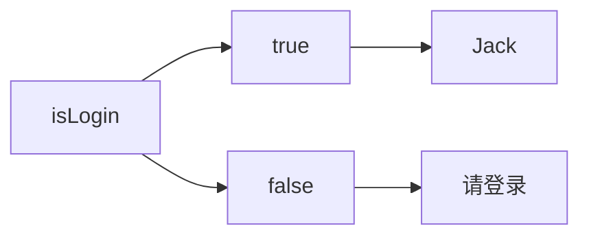

## 环境准备
### 创建工程
React浏览器开发插件：`React Developer Tools`
#### webpack
create-react-app是一个快速创建React开发环境的工具，底层由Webpack构件，封装了配置细节，开箱即用
CMD执行命令：`npx create-react-app 工程文件名`

#### Vite
CMD执行命令：`npm create vite@latest react-typescript -- --template react-ts`
### 路径解析配置
#### webpack-js
配置步骤：

1. 安装craco：`npm i -D @craco/craco`
2. 项目根目录下创建配置文件：`craco.config.js`
3. 配置文件中添加路径解析配置
```javascript
const path = require('path')

module.exports = {
    // webpack配置
    webpack: {
        // 配置别名
        alias: {
            // 约定：使用@表示src 文件所在路径
            '@': path.resolve(__dirname, 'src/'),
        },
    },
}
```

4. 包文件中配置启动和打包命令
```json
"scripts": {
    "start": "craco start",
    "build": "craco build"
}
```
#### Vite-ts
```typescript
import { defineConfig } from 'vite'
import react from '@vitejs/plugin-react'
import path from 'path'

// https://vitejs.dev/config/
export default defineConfig({
    plugins: [react()],
    resolve: {
        alias: {
            '@': path.resolve(__dirname, './src'),
        },
    },
})

```
### 联想路径配置
#### webpack-js
配置步骤：

1. 根目录下新增配置文件 - jsconfig.json
2. 添加路径提示配置
```json
{
    "compilerOptions": {
        "baseUrl": "./",
        "paths": {
            "@/*": ["src/*"]
        }
    }
}
```
#### Vite-ts
安装node类型包：`npm i @types/node -D`
```json
{
    "baseUrl": ".",
    "paths": {
        "@/*": [
            "src/*"
        ]
    },
}
```
## React基础
### JSX基础
JSX是JavaScript和XMl(HTML)的缩写，表示在JS代码中编写HTML模版结构，它是React中构建UI的方式。
```jsx
const message = 'this is message'

function App(){
    return (
        <div>
            <h1>this is title</h1>
            {message}
        </div>
    )
}
```
优势：

1. HTML的声明式模版写法
2. JavaScript的可编程能力
#### 本质
JSX不是标准的JS语法，它是JS的语法扩展，浏览器本身不能识别，需要通过解析工具做解析之后才能在浏览器中使用


#### JS表达式
```jsx
const message = "this is message"
function App() {
    return (
        <div>
            {/* 使用引号传递字符串 */}
            {"This is a div!"}
            {/* 使用JS变量 */}
            {message}
            {/* 函数调用 */}
            {getMessage()}
            {/* 方法调用 */}
            {new Date().toString()}
            {/* 使用JS对象 */}
            <div style={{ color: "red" }}>This is a div!</div>
        </div>
    );
}

export default App;
```
#### 列表渲染


在JSX中可以使用原生js中的`map方法`实现列表渲染。

```jsx
const list = [
    {id:1001, name:'Vue'},
    {id:1002, name: 'React'},
    {id:1003, name: 'Angular'}
]

function App() {
    return (
        {/* 列表渲染 */}
        <ul>
            {list.map((item) => (
                <li key={item.id}>{item.name}</li>
            ))}
        </ul>
    )
}
```
> `key={item.id}`能够优化渲染速度

#### 条件渲染
逻辑运算符与三目运算符



```jsx
const flag = true
const loading = false

function App(){
  return (
    <>
      {/* 逻辑 */}
      {flag && <span>this is span</span>}
      {/* 三目 */}
      {loading ? <span>loading...</span>:<span>this is span</span>}
      {isLogin ? <span>Jack</span>:<span>请登录</span>}
    </>
  )
}
```
#### 复杂条件渲染
`if……else` `if……else`
```jsx
const type = 1  // 0|1|3

function getArticleJSX(){
  if(type === 0){
    return <div>无图模式模版</div>
  }else if(type === 1){
    return <div>单图模式模版</div>
  }else{
    return <div>三图模式模版</div>
  }
}

function App(){
  return (
    <>
      { getArticleJSX() }
    </>
  )
}
```
### 事件绑定
#### 基本用法
React中的事件绑定，通过语法 `on + 事件名称 = { 事件处理程序 }`，整体上遵循驼峰命名法。
```jsx
function App(){
  // 这个方法写在App()的内外都可以
  const clickHandler = ()=>{
    console.log('button按钮点击了')
  }
  return (
    <button onClick={clickHandler}>click me</button>
  )
}
```
#### 事件参数
在事件回调函数中设置形参`e`即可（名字随意，e、eve、event都可以）
```jsx
function App(){
  const clickHandler = (e)=>{
    console.log('button按钮点击了', e)
  }
  return (
    <button onClick={clickHandler}>click me</button>
  )
}
```
> 这里的 `e` 是一个 **合成事件对象**
>
> - **跨浏览器兼容性**：它封装了不同浏览器之间原生事件的差异，确保你的代码在各种浏览器中行为一致。
> - **性能优化**：React 会对事件对象进行“事件池”管理。事件处理函数执行完毕后，合成事件对象会被重新放回池中，而不是每次都创建新的，从而提高性能。这意味着，如果你需要异步访问 `e` 的属性，你需要调用 `e.persist()`，否则 `e` 的属性可能会被重置为 `null`。
> - **提供了与原生事件相同的接口**：虽然是合成的，但它提供了与原生 DOM 事件对象相似的属性和方法，例如 `e.target`（触发事件的 DOM 元素）、`e.currentTarget`（事件绑定的 DOM 元素）、`e.preventDefault()`（阻止默认行为）、`e.stopPropagation()`（阻止事件冒泡）等。

#### 自定义参数

事件绑定的位置改造成箭头函数的写法，在执行`clickHandler`实际处理业务函数的时候传递实参。
```jsx
function App(){
  const clickHandler = (name)=>{
    console.log('button按钮点击了，姓名为', name)
  }
  return (
    <button onClick={()=>clickHandler('jack')}>click me</button>
  )
}
```
> [!important]
>
> 不能直接写函数调用，因为事件绑定需要一个函数引用！
>
> 当你写 `onClick={clickHandler('jack')}` 时，`clickHandler('jack')` 会**立即执行**。这意味着在组件渲染的时候，`clickHandler` 函数就会被调用，并且它的返回值（在本例中是 `undefined`，因为 `clickHandler` 没有显式返回任何东西）会被赋值给 `onClick` 属性。这样一来，当你点击按钮时，实际上就没有函数可以被调用了。
>
> 可以把 `onClick={clickHandler('jack')}` 想象成：
>
> 1. 组件渲染。
> 2. `clickHandler('jack')` 被执行。
> 3. `console.log('button按钮点击了，姓名为', 'jack')` 会立即打印到控制台。
> 4. `onClick` 属性的值现在是 `undefined`。
> 5. 当你点击按钮时，没有任何事情发生。

#### 同时传递事件对象和自定义参数
在事件绑定的位置传递事件实参`e`和自定义参数，`clickHandler`中声明形参，**注意顺序对应。**
```jsx
function App(){
  const clickHandler = (name,e)=>{
    console.log('button按钮点击了，姓名：', name,e)
  }
  return (
    <button onClick={(e)=>clickHandler('jack',e)}>click me</button>
  )
}
```
### 组件基础
一个组件就是一个用户界面的一部分，它可以有自己的逻辑和外观，组件之间可以互相嵌套，也可以复用多次


#### 基本使用
一个组件就是**首字母大写的函数**，内部存放了组件的逻辑和视图UI, 渲染组件只需要把组件当成标签书写即可
#### 状态管理
##### 基础使用
`useState` 是一个 React Hook（函数），它允许我们向组件添加一个`状态变量`, 从而控制影响组件的渲染结果。

和普通JS变量不同的是，状态变量一旦发生变化组件的视图UI也会跟着变化（数据驱动视图）


```jsx
import React from "react";
function App(){
  const [ count, setCount ] = React.useState(0)
  return (
    <div>
			<button onClick={() => setCount(count + 1)}>{count}</button>
    </div>
  )
}
```
##### 状态修改规则
状态被认为是只读的，我们应该始终**替换它而不是修改它**, 直接修改状态不能引发视图更新


```jsx
const [count, setCount] = React.useState(0);
const handlerClick = () => {
    setCount(count + 1);
};
```
##### 修改对象状态
对于对象类型的状态变量，应该始终给set方法一个**全新的对象**来进行修改


```jsx
const [form, setForm] = useState({
    name: "Jack",
});
const handleChangeName = () => {
    setForm({
        ...form,	// ...用于创建对象的浅拷贝，它可以复制对象中的所有可枚举属性到新对象中
        name: "John",
    });
};
```
#### 基础样式处理
##### 行内样式
```jsx
const style = {
    color: "red",
    fontSize: "20px"	// 注意要写成 驼峰形式
};

function App() {
    return (
        <div>
            {/* 行内样式控制 */}
            <div style={{ fontSize: "25px", color: "green" }}>this is div tag</div>
            <span style={style}>This is span tag</span>
        </div>
    );
}
```
##### class类名控制
```css
.foo {
    color: blue;
    font-size: 22px;
}
```
```jsx
import "./index.css";

function App() {
    return (
        <div>
            {/* 通过class类名控制样式 */}
            <span className="foo">This is class foo</span>
        </div>
    );
}
```
### 表单控制
#### 受控绑定
在受控组件中，表单元素的值由 React 的 state 控制。当用户输入时，React 通过更新组件的 state 来反映输入的变化。受控组件中的值始终由 React 控制，并通过 props 将当前值传递给表单元素。


```jsx
import { useState } from "react";

function App() {
  	// 声明一个React状态
	const [value, setValue] = useState("");
	return (
		<input
			type="text"
			value={value}   // 通过value属性绑定react状态
      		// 绑定onChange事件 通过事件参数e拿到输入框最新的值
			onChange={(e) => setValue(e.target.value)}
		/>
	);
}
```
本例中，输入框的值受到 value 状态的控制，用户的输入会更新该状态，并且该状态的变化会被反映到输入框中。
#### 非受控绑定
在非受控组件中，表单元素的值不受 React state 的控制，而是由 DOM 元素自身来管理。React 组件只是在需要时获取 DOM 元素的值，而不直接控制其值的变化。
```jsx
import { useRef } from "react";

function App() {
	// 生成ref对象，绑定到DOM标签上
	const inputRef = useRef(null);
	const onChange = () => {
		// DOM可用时，ref.current获取dom
		// 渲染完毕之后DOM生成之后才可用
		console.log(inputRef.current.value);
	};
	const handlerClick = () => {
		console.log(`Input value:${inputRef.current.value}`);
	};
	return (
		<div>
			<input type="text" ref={inputRef} onChange={onChange} />
			<button onClick={handlerClick}>Get Value</button>
		</div>
	);
}
```
### 组件通信
组件通信就是组件之间的数据传递, 根据组件嵌套关系的不同，有不同的通信手段和方法


| A-B 父子通信 | B-C 兄弟通信 | A-E 跨层通信 |
| :----------: | :----------: | :----------: |

#### 父子通信——父传子

##### 基础实现

1. 父组件传递数据 - 在子组件标签上绑定属性
2. 子组件接收数据 - 子组件通过props参数接收数据
```jsx
function Son(props){
  return <div>从父组件接收到的：{ props.name }</div>
}

function App(){
  const name = 'this is app name'
  return (
    <div>
       <Son name={name}/>
    </div>
  )
}
```
##### props说明
**props可以传递任意的合法数据**，比如数字、字符串、布尔值、数组、对象、函数、JSX


**props是只读对象**子组件只能读取props中的数据，不能直接进行修改, 父组件的数据只能由父组件修改

##### 特殊的prop-children
当把内容嵌套在组件的标签内部时，组件会自动在名为children的prop属性中接收该内容

```jsx
function Son(props) {
  console.log(props);
  return (
    <div>
      {props.children[1]}		{/* <b>!1this is b tag from father1!</b> */}
    </div>
  );
}

function App() {
  const appName = "this is app name";
  return (
    <div>
      <Son>
        <sub>!0this is sub tag from father0!</sub>
        <b>!1this is b tag from father1!</b>
      </Son>
    </div>
  );
}
```
#### 父子通信——子传父


核心思路：在子组件中调用父组件中的函数并传递参数

```jsx
function Son({ onGetMsg }) {
	const sonMsg = "this is son msg";
	return (
		<div>
			{/* 在子组件中执行父组件传递过来的参数 */}
			<button onClick={() => onGetMsg(sonMsg)}>send msg to father</button>
		</div>
	);
}

function App() {
	const getMsg = (msg) => {
		console.log(msg);
	};
	return (
		<div>
			<Son onGetMsg={getMsg} />
		</div>
	);
}
```
#### 兄弟通信


实现思路: 借助 **状态提升** 机制，通过共同的父组件进行兄弟之间的数据传递

1. A组件先通过子传父的方式把数据传递给父组件App
2. App拿到数据之后通过父传子的方式再传递给B组件
```jsx
// 1. 通过子传父 A -> App
// 2. 通过父传子 App -> B

import { useState } from "react";

function A({ onGetAName }) {
	// Son组件中的数据
	const name = "this is A name";
	return (
		<div>
			this is A compnent,
			<button onClick={() => onGetAName(name)}>send</button>
		</div>
	);
}

function B({ name }) {
	return (
		<div>
			this is B compnent,
			{name}
		</div>
	);
}

function App() {
	const [name, setName] = useState("");
	const getAName = (name) => {
		setName(name);
	};
	return (
		<div>
			this is App
			<A onGetAName={getAName} />
			<B name={name} />
		</div>
	);
}

export default App;
```

---

```jsx
import React, { useState } from 'react';
import SiblingA from './SiblingA';
import SiblingB from './SiblingB';

function ParentComponent() {
  const [name, setName] = useState('');

  return (
    <div>
      <SiblingA setName={setName} />
      <SiblingB name={name} />
    </div>
  );
}

export default ParentComponent;
```
```jsx
function SiblingA({ setName }) {
	const handleInputChange = (event) => {
		setName(event.target.value);
	};

	return (
		<div>
			<input
				type="text"
				placeholder="Enter name please"
				onChange={handleInputChange}
			/>
		</div>
	);
}

export default SiblingA;
```
```jsx
function SiblingB({ name }) {
	const handleButtonClick = () => {
		alert(`Hello SiblingB ${name} !`);
	};

	return (
		<div>
			<button onClick={handleButtonClick}>SiblingB Say Hello</button>
		</div>
	);
}

export default SiblingB;
```
#### 跨组件通信


**实现步骤：**

1. 使用 `createContext`方法创建一个上下文对象Ctx
2. 在顶层组件（App）中通过 `Ctx.Provider` 组件提供数据
3. 在底层组件（B）中通过 `useContext` 钩子函数获取消费数据
```jsx
// 跨组件通信
// App -> A -> B

import { createContext, useContext } from "react";

// 1、createContext方法创建一个上下文对象
const MsgContext = createContext();

function A() {
    return (
        <div>
            this is A ParentComponent
            <B />
        </div>
    )
}

function B() {
    // 3、在底层组件通过useContext钩子函数使用数据
    const msg = useContext(MsgContext)
    return (
        <div>
            this is B component,{msg}
        </div>
    )
}

function App() {
    const msg = 'this is app msg'
    return (
        <div>
            {/* 2、在顶层组件通过Provider组件提供数据 */}
            <MsgContext.Provider value={msg}>
                this is App
                <A />
            </MsgContext.Provider>
        </div>
    )
}

export default App
```
#### 总结
**组件间的关系**

- 父子组件
- 兄弟组件（非嵌套组件）
- 祖孙组件（跨级组件）

**通信方式**

- props
   - children props
   - render props
- 消息订阅-发布
   - pubs-sub、event……
- 集中式管理
   - redux、dva……
- conText
   - 生产者-消费者模式

**推荐的搭配方式**

- 父子组件：props
- 兄弟组件：消息订阅-发布、集中式管理
- 祖孙组件（跨级组件）：消息订阅-发布、集中式管理、conText(开发用得少，封装插件用得多)
### 副作用管理
#### 概念
`useEffect`是一个React Hook函数，用于在React组件中创建不是由事件引起而是由渲染本身引起的操作（副作用）, 比如发送AJAX请求、手动更改真实DOM、设置订阅/启动定时器


#### 基本使用
语法：`useEffect(() => {}, [])`

说明：

1. 参数1是一个函数，可以把它叫做副作用函数，在函数内部可以放置要执行的操作
2. 参数2是一个数组（可选参），在数组里放置依赖项，不同依赖项会影响第一个参数函数的执行，当是一个空数组的时候，副作用函数只会在组件渲染完毕之后执行一次
```jsx
useEffect(() => { 
  // 在此可以执行任何带副作用操作
  return () => { // 在组件卸载前执行
    // 在此做一些收尾工作, 比如清除定时器/取消订阅等
  }
}, [stateValue]) // 如果指定的是[], 回调函数只会在第一次render()后执行
```
```jsx
import { useEffect, useState } from "react";

function App() {
	const [count, setCount] = useState(0);

	// 每次渲染后更新文档标题
	useEffect(() => {
		document.title = `You have clicked ${count} times`;
	}, [count]); // 仅在 count 发生变化时重新运行

	return (
		<div>
			<p>You have clicked {count} times</p>
			<button onClick={() => setCount(count + 1)}>Click me</button>
		</div>
	);
}

export default App;
```
#### 依赖说明
useEffect副作用函数的执行时机存在多种情况，根据传入依赖项的不同，会有不同的执行表现

| **依赖项** | **副作用功函数的执行时机** |
| --- | --- |
| 没有依赖项 | 组件初始渲染 + 组件更新时执行 |
| 空数组依赖 | 只在初始渲染时执行一次 |
| 添加特定依赖项 | 组件初始渲染 + 依赖项变化时执行 |

#### 清除副作用
在useEffect中编写的由渲染本身引起的对接组件外部的操作，社区也经常把它叫做副作用操作，比如在useEffect中开启了一个定时器，我们想在组件卸载时把这个定时器再清理掉，这个过程就是清理副作用


> 清除副作用的函数最常见的执行时机是在组件卸载时自动执行

```jsx
import { useEffect, useState } from "react";

function Son() {
	// 1. 渲染时开启一个定时器
	useEffect(() => {
		const timer = setInterval(() => {
			console.log("定时器执行中...");
		}, 1000);

		return () => {
			// 清除副作用(组件卸载时)
			clearInterval(timer);
		};
	}, []);
	return <div>this is son</div>;
}

function App() {
	// 通过条件渲染模拟组件卸载
	const [show, setShow] = useState(true);
	return (
		<div>
			{show && <Son />}
			<button onClick={() => setShow(false)}>卸载Son组件</button>
		</div>
	);
}

export default App;
```
### Hook函数
#### useReducer
`useReducer`用于管理组件的state。它类似于`redux`中的reducer概念,允许我们基于当前的state和指定操作(action),计算出新的state。`useReducer`提供了一种管理复杂state逻辑的优雅方式,特别是在需要共享状态逻辑或引用追踪的场景下非常有用。

**语法**

```jsx
const [state, dispatch] = useReducer(reducer, initialState, init);
```

- `reducer`: 一个函数,接受当前state和action,返回新的state。
- `initialState`: 初始state。
- `init`: 可选的函数,用于延迟初始化state。
- `state`: 当前state。
- `dispatch`: 一个函数,用于触发state更新。


**为什么使用useReducer?**

1. **简化复杂state逻辑**：在组件中有多个state源,且需要复杂的逻辑来更新它们时,可以使用useReducer提供一个集中式的操作。
2. **重用逻辑**：reducer函数可在组件或hooks间共享。
3. **捕获引用值**：在某些场景下,reducer可以获取state前后变化的引用值,而通过`useState`则不能。
4. **更好的debug**：reducer总是返回全新的state,更容易观察state的变化。
```jsx
// 1. 定义reducer函数，根据不同的action状态返回不同的新状态
import {useReducer} from "react";

function reducer(state, action) {
    switch (action.type) {
        case 'INC':
            return {...state, count: state.count + 1};
        case 'DEC':
            return {...state, count: state.count - 1};
        case 'UPDATE':
            return {count: action.payload};
        default:
            return state.count;
    }
}

// 初始state
const initialState = {count: 0};

function App() {
    // 2. 使用useReducer分派action
    const [state, dispatch] = useReducer(reducer, initialState)
    return (
        <div>
            {/* 3. 调用dispatch函数传入action对象，触发reducer函数，分派action操作，使用新状态更新视图*/}
            <button onClick={() => dispatch({type: 'DEC'})}>-</button>
            {state.count}
            <button onClick={() => dispatch({type: 'INC'})}>+</button>
            <button onClick={() => dispatch({type: 'UPDATE', payload: 100})}>SET 100</button>
        </div>
    )
}

export default App
```
##### 对比useState
`useState`和`useReducer`都是React hooks中用于管理状态的钩子函数,但它们在使用场景和方式上存在一些差异:

**useState**:

- `useState`主要用于管理简单的状态,如字符串、数字、布尔值、对象或数组等。
- 每个状态只需要一个`setState`函数即可完成修改。
- 状态更新是直接覆盖原有状态。
- 状态逻辑相对简单直观。

**useReducer**:

- `useReducer`主要用于管理复杂的状态逻辑。
- 通过定义一个 reducer 函数集中处理多个状态的更新逻辑。
- 利用 action 对象描述不同的状态转换情况。
- 状态更新遵循纯函数式无副作用的模式,返回全新状态对象。
- 状态逻辑相对复杂,但更加结构化、可维护。
- 适合多个组件共享状态逻辑。

一般而言:

- 如果状态逻辑很简单,只有几个状态需要管理,使用`useState`即可。
- 如果有复杂的状态逻辑,多个子值需要共享逻辑、引用追踪等,使用`useReducer`会更加适合。
#### useMemo
作用：缓存计算结果

语法：`const memoizedValue = useMemo(() => computeExpensiveValue(a, b), [a, b]);`

- computeExpensiveValue(a, b): 你需要缓存的那个"昂贵"计算的函数,它应该是一个纯函数。
- [a, b]: 依赖数组,当a或b的值发生变化时,computeExpensiveValue(a, b)会重新执行。
```jsx
import React, {useMemo, useState} from 'react';

function fibonacci(n) {
    console.log('计算函数执行了！')
    if (n <= 1) return n;
    return fibonacci(n - 1) + fibonacci(n - 2);
}

function App() {
    const [number, setNumber] = useState(10);

    // 通过useMemo缓存计算结果，只有number发生变化时才重新计算
    const sum = useMemo(() => {
        return fibonacci(number)
    }, [number])

    return (
        <div>
            <label>
                Fibonacci of
                <input
                    type="number"
                    value={number}
                    onChange={(e) => setNumber(Number(e.target.value))}
                />
            </label>
            <p>Fibonacci({number}) = {sum}</p>
        </div>
    );
}

export default App
```
#### useCallback
`useCallback` 是另一个优化性能的 Hook。它用于缓存函数实例,避免在每次渲染时重新创建相同的函数。
```jsx
const memoizedCallback = useCallback(
  () => {
    // 函数体
  },
  [dependencies]
);
```

- 第一个参数是需要被缓存的函数。
- 第二个参数是依赖数组,当依赖项发生变化时,函数实例会被重新创建。

使用场景

- 作为回调函数传递给子组件：如果一个回调函数作为 prop 传递给子组件,则应该使用 useCallback 对其进行缓存,以防止子组件不必要的重渲染。
- 在依赖项未发生变化时复用相同的函数实例：如果一个函数只依赖于某些状态或 props,那么只有在依赖项发生变化时才需要重新创建函数实例。

案例:
```jsx
import { memo, useCallback, useState } from 'react'

const MemoSon = memo(function Son() {
    console.log('Son组件渲染了')
    return <div>this is son</div>
})

function App() {
    const [, forceUpdate] = useState()
    console.log('父组件重新渲染了')
    const onGetSonMessage = useCallback((message) => {
        console.log(message)
    }, [])

    return (
        <div>
            <MemoSon onGetSonMessage={onGetSonMessage} />
            <button onClick={() => forceUpdate(Math.random())}>update</button>
        </div>
    )
}

export default App
```
#### useImperativeHandle
`useImperativeHandle` 是 React 提供的一个钩子,它可以与 `forwardRef` 一起使用,允许父组件获取子组件内部的一些命令或方法,从而控制子组件的行为。
**语法**
```jsx
useImperativeHandle(ref, createHandle, [deps])
```

- `ref` 是通过 `forwardRef` 传入的 ref 引用。
- `createHandle` 是一个函数,返回一个对象,该对象暴露给父组件访问和操作子组件的命令。
- `deps` 是一个可选的依赖数组,当依赖项变化时,`createHandle` 会重新执行。

**使用场景**
通常情况下,React 推荐使用自上而下的数据流,通过传递 props 控制子组件。但在某些情况下,父组件需要直接访问子组件的内部方法或状态,这时就可以使用 `useImperativeHandle`。
**示例**
```jsx
import React, { forwardRef, useImperativeHandle, useRef } from 'react';

const InputComponent = forwardRef((props, ref) => {
  // 实现内部的聚焦逻辑
  const inputRef = useRef(null);
  // 暴露子组件内部的聚焦方法 
  useImperativeHandle(ref, () => ({
    focus: () => {
      inputRef.current.focus();
    }
  }), []);

  return <input type="text" ref={inputRef} />;
});

const App = () => {
  const inputRef = useRef(null);

  const focusInput = () => {
    inputRef.current.focus();
  };

  return (
    <div>
      <InputComponent ref={inputRef} />
      <button onClick={focusInput}>Focus Input</button>
    </div>
  );
};
```
在这个例子中:

1. `InputComponent` 是一个子组件,通过 `forwardRef` 获取父组件传递的 ref 引用。
2. 在 `InputComponent` 内部,使用 `useImperativeHandle` 暴露了一个 `focus` 方法给父组件。
3. 父组件 `App` 通过 `inputRef.current` 可以访问到子组件暴露的 `focus` 方法。
4. 当点击按钮时,调用 `inputRef.current.focus()`  能够聚焦文本输入框。

#### 自定义Hook
自定义Hook必须是以 `use`**开头的函数**，通过自定义Hook函数可以用来**实现逻辑的封装和复用**


```jsx
// 问题: 布尔切换的逻辑 当前组件耦合在一起的 不方便复用
// 解决思路: 自定义hook

import { useState } from "react";

function useToggle() {
	// 可复用的逻辑代码
	const [value, setValue] = useState(true);

	const toggle = () => setValue(!value);

	// 哪些状态和回调函数需要在其他组件中使用，就return
	return {
		value,
		toggle,
	};
}

// 封装自定义hook通用思路
// 1、声明一个以use开头的函数
// 2、在函数体内封装可复用的逻辑（只要是可复用的逻辑）
// 3、把组件中用到的状态或者回调return出去
// 4、在哪个组件中要用到这个逻辑，就执行这个函数，解构出来状态和回调进行使用

function App() {
	const { value, toggle } = useToggle();
	return (
		<div>
			{value && <div>this is div</div>}
			<button onClick={toggle}>toggle</button>
		</div>
	);
}

export default App;
```
使用规则

1. 只能在组件中或者其他自定义Hook函数中调用
2. 只能在组件的顶层调用，不能嵌套在if、for、其它的函数中
### React API
#### memo
作用：允许组件在props没有改变的情况下跳过重新渲染
memo 是一个高阶组件(HOC),它用于包裹 React 组件,用于优化组件的渲染性能。memo 会缓存组件的渲染结果,当组件的 props 发生变化时,才会重新渲染组件,否则就直接复用上一次的渲染结果。
```jsx
import React, { memo } from 'react';

const MyComponent = memo(function MyComponent(props) {
  /* 使用 props 渲染组件 */
});
```
```jsx
const MyComponent = memo(
  React.memo(function MyComponent(props) {
    /* 使用 props 渲染组件 */
  }),
  (prevProps, nextProps) => {
    /* 自定义比较函数，比较新旧 props 是否相等 */
    /* 如果返回 true，则组件不会重新渲染 */
    /* 如果返回 false，则组件将重新渲染 */
  }
);
```
使用场景

- 当组件的渲染代价很高时，可以使用 `memo` 包裹组件，避免不必要的重渲染。
- 当组件是一个纯组件(Pure Component)时，即组件的输出只依赖于 `props` 的变化。
- 当组件被频繁重渲染时，使用 `memo` 可以减少不必要的重渲染。

注意事项

- memo 只会对组件的 props 进行浅层比较,如果 props 中包含了复杂对象或数组,只有引用发生变化时才会触发重渲染,对象或数组内部数据的变化不会触发重渲染。
- memo 不会比较组件的 state,因此如果组件的渲染依赖于 state,使用 memo 也不会阻止组件重渲染。
- memo 不应该用于函数组件中的每一个渲染,这可能会导致意外的重渲染。通常只需要为大型组件或高开销的子组件使用 memo。
- memo 只是一种性能优化的方式,并不是必需的,也不能滥用。
##### 组件默认的渲染机制
默认机制：顶层组件发生重新渲染，这个组件树的子级组件都会被重新渲染
```jsx
import { useState } from 'react'

function Son() {
  console.log('子组件被重新渲染了')
  return <div>this is son</div>
}

function App() {
  const [, forceUpdate] = useState()
  console.log('父组件重新渲染了')
  return (
    <>
      <Son />
      <button onClick={() => forceUpdate(Math.random())}>update</button>
    </>
  )
}

export default App
```
##### 使用React.memo优化
机制：只有props发生变化时才重新渲染
下面的子组件通过 memo 进行包裹之后，返回一个新的组件MemoSon, 只有传给MemoSon的props参数发生变化时才会重新渲染
```jsx
import { memo, useState } from 'react'

const MemoSon = memo(function Son() {
  console.log('子组件被重新渲染了')
  return <div>this is span</div>
})

function App() {
  const [, forceUpdate] = useState()
  console.log('父组件重新渲染了')
  return (
    <>
      <MemoSon />
      <button onClick={() => forceUpdate(Math.random())}>update</button>
    </>
  )
}

export default App
```
##### props的比较机制
| 基本类型 | 对象/复杂/引用类型 |
| --- | --- |
| 比较数值  | 比较引用 |

```jsx
import {memo, useState} from "react";

const MemoSon = memo(function Son({num, list}) {
    console.log('子组件被重新渲染了！')
    return (
        <div>
            this is Son!{num}.{list}
        </div>
    )
})

function App() {
    console.log('父组件重新渲染了!')
    const [, forceUpdate] = useState()
    const [num, setNum] = useState(100)
    const list = [1,3,5]
    return (
        <div>
            <MemoSon num={num} list={list}/>
            <button onClick={() => setNum(111)}>update</button>
            <button onClick={() => forceUpdate(Math.random())}>update</button>
        </div>
    )
}

export default App;
```
上面的例子中给子组件传入了基本类型`num`和引用类型`list`

- 第一个按钮修改了`num`的值，故子组件会重新渲染
- 第二个按钮没有修改`list`的值，但是因为组件App俩次渲染生成了不同的对象引用list，所以传给MemoSon组件的props视为不同，子组件也会发生重新渲染
##### 自定义比较函数
如果上一小节的例子，我们不想通过引用来比较，而是完全比较数组的成员是否完全一致，则可以通过自定义比较函数来实现
```jsx
import React, { useState } from 'react'

// 自定义比较函数
function arePropsEqual(oldProps, newProps) {
  console.log(oldProps, newProps)
  return (
    oldProps.list.length === newProps.list.length &&
    oldProps.list.every((oldItem, index) => {
      const newItem = newProps.list[index]
      console.log(newItem, oldItem)
      return oldItem === newItem
    })
  )
}

const MemoSon = React.memo(function Son() {
  console.log('子组件被重新渲染了')
  return <div>this is span</div>
}, arePropsEqual)

function App() {
  console.log('父组件重新渲染了')
  const [list, setList] = useState([1, 2, 3])
  return (
    <>
      <MemoSon list={list} />
      <button onClick={() => setList([1, 2, 3])}>
        内容一样{JSON.stringify(list)}
      </button>
      <button onClick={() => setList([4, 5, 6])}>
        内容不一样{JSON.stringify(list)}
      </button>
    </>
  )
}

export default App
```
#### forwardRef
`forwardRef` 是 React 提供的一种底层技术,用于在组件渲染时重新绑定 ref 引用,让父组件可以引用子组件的实例,或访问子组件内部的DOM节点。
**用法**
```jsx
const ChildComponent = React.forwardRef((props, ref) => {
  // 使用 ref 访问组件实例或 DOM 节点
  return <div ref={ref}>...</div>
});
```
```jsx
// 在父组件中引用子组件
const ParentComponent = () => {
  const childRef = useRef(null);

  useEffect(() => {
    // 访问子组件实例或 DOM 节点
    console.log(childRef.current);
  }, []);

  return <ChildComponent ref={childRef} />;
}
```
**使用场景**

1. **操作子组件的实例**:通过 ref 获取子组件的实例,调用其方法或访问其成员。
2. **访问子组件内部DOM节点**:获取子组件渲染的DOM元素的引用。
3. **集成第三方库**:一些第三方库需要直接访问组件实例或DOM节点。

**注意事项**

- 不要过度使用`forwardRef`,因为它会增加组件的复杂性,影响可维护性。
- `forwardRef`不能在函数式组件上使用,只能用于类组件或创建高阶组件。
- 如果只需要操作DOM,使用`useRef`钩子获取ref更加方便。

**示例**
```jsx
// 子组件使用 forwardRef
const InputComponent = React.forwardRef((props, ref) => {
  return <input type="text" ref={ref} />;
});

// 父组件获取子组件的 DOM 引用
const ParentComponent = () => {
  const inputRef = useRef(null);

  const focusInput = () => {
    // 访问子组件的实例、DOM节点
    inputRef.current.focus();
  };

  return (
    <div>
      <InputComponent ref={inputRef} />
      <button onClick={focusInput}>Focus Input</button>
    </div>
  );
};
```
在这个例子中,父组件通过`forwardRef`获取了子组件渲染的`input`元素的 DOM 引用。当点击按钮时,可以调用`inputRef.current.focus()`方法来聚焦文本输入框。
### Class API
> 类式组件已过时！！！[Component – React 中文文档](https://zh-hans.react.dev/reference/react/Component)

#### 基础体验
```jsx
// class API
import { Component } from 'react'

class Counter extends Component {
  // 状态变量
  state = {
    count: 0,
  }

  // 事件回调
  clickHandler = () => {
    // 修改状态变量 触发UI组件渲染
    this.setState({
      count: this.state.count + 1,
    })
  }

  // UI模版
  render() {
    return <button onClick={this.clickHandler}>+{this.state.count}</button>
  }
}

function App() {
  return (
    <div>
      <Counter />
    </div>
  )
}

export default App
```
#### 生命周期

#### 组件通信
##### 父传子
```jsx
// class API
import { Component } from 'react'

class Son extends Component {
  render() {
    const { count } = this.props
    return <div>this is Son, {count}</div>
  }
}

class App extends Component {
  // 状态变量
  state = {
    count: 0,
  }

  setCount = () => {
    this.setState({
      count: this.state.count + 1,
    })
  }

  // UI模版
  render() {
    return (
      <>
        <Son count={this.state.count} />
        <button onClick={this.setCount}>+</button>
      </>
    )
  }
}

export default App
```
##### 子传父
```jsx
// class API
import { Component } from 'react'

class Son extends Component {
  render() {
    const { msg, onGetSonMsg } = this.props
    return (
      <>
        <div>this is Son, {msg}</div>
        <button onClick={() => onGetSonMsg('this is son msg')}>
          changeMsg
        </button>
      </>
    )
  }
}

class App extends Component {
  // 状态变量
  state = {
    msg: 'this is initail app msg',
  }

  onGetSonMsg = (msg) => {
    this.setState({ msg })
  }

  // UI模版
  render() {
    return (
      <>
        <Son msg={this.state.msg} onGetSonMsg={this.onGetSonMsg} />
      </>
    )
  }
}

export default App
```

### 工具库

#### lodush

[Lodash 简介 | Lodash中文文档 | Lodash中文网](https://www.lodashjs.com/)
Lodash 是一个 JavaScript 实用工具库，提供了许多实用的功能，帮助开发者在编写 JavaScript 代码时更高效、更方便。它提供了对数组、对象、函数、字符串等数据类型的处理方法，同时还提供了许多实用的工具函数，用于简化常见的编程任务。

```shell
npm install --save lodush
```

```jsx
import _ from 'lodash'
```

#### classnames

`classnames` 是一个 JavaScript 工具库，用于动态生成 HTML 元素的 class 字符串。它通常在 React 应用程序中用于简化条件性地应用 CSS 类名。
`classnames` 可以更方便地处理动态 class 名称的拼接，特别是在有多个条件需要考虑时，代码会更加清晰和简洁。

1.  **安装**`classnames`：
    你可以使用 npm 或者 yarn 来安装 `classnames`： 

```bash
npm install classnames
```

2.  **基本用法**： 

```javascript
import classNames from 'classnames';

const buttonClass = classNames({
  'btn': true,
  'btn-primary': true,
  'btn-large': false
});

// buttonClass 的值为 'btn btn-primary'
```

在这个例子中，`classNames` 接受一个对象作为参数，对象的 key 是 class 名称，value 是一个布尔值，表示是否应该包含该 class。`classNames` 会将 value 为 true 的 class 名称添加到最终的 class 字符串中。 

3.  **条件性应用 class**： 

```javascript
import classNames from 'classnames';

const active = true;
const buttonClass = classNames('btn', {
  'btn-primary': active,
  'btn-large': !active
});

// buttonClass 的值为 'btn btn-primary'
```

本例中，`btn` class 总会被添加，而 `btn-primary` 或 `btn-large` 则根据 `active` 变量的值进行条件性添加。

4.  **数组作为参数**： 

```javascript
import classNames from 'classnames';

const size = 'small';
const buttonClass = classNames('btn', ['btn-primary', 'btn-large'], {
  'btn-small': size === 'small',
  'btn-medium': size === 'medium',
  'btn-large': size === 'large'
});

// 如果 size 为 'small'，则 buttonClass 的值为 'btn btn-primary btn-large btn-small'
```

本例展示了如何将数组作为参数传递给 `classnames`，数组中的每个元素都会被添加到最终的 class 字符串中。 

#### UUID

[GitHub - uuidjs/uuid: Generate RFC-compliant UUIDs in JavaScript](https://github.com/uuidjs/uuid)

```shell
npm install uuid
```

```javascript
import { v4 as uuidv4 } from 'uuid';
uuidv4(); // ⇨ '9b1deb4d-3b7d-4bad-9bdd-2b0d7b3dcb6d'
```

#### days

[Day.js中文网](https://dayjs.fenxianglu.cn/)
处理日期时间

## React&TypeScript

### useState
#### 简单场景
> 简单场景下，可以使用TS的自动推断机制，不用特殊编写类型注解，运行良好

```typescript
const [val, toggle] = React.useState(false)

// `val` 会被自动推断为布尔类型
// `toggle` 方法调用时只能传入布尔类型
```
#### 复杂场景
> 复杂数据类型，useState支持通过`泛型参数`指定初始参数类型以及setter函数的入参类型

```typescript
type User = {
  name: string
  age: number
}
const [user, setUser] = React.useState<User>({
  name: 'jack',
  age: 18
})
// 执行setUser
setUser(newUser)
// 这里newUser对象只能是User类型
```
#### 没有具体默认值
> 实际开发时，有些时候useState的初始值可能为null或者undefined，按照泛型的写法是不能通过类型校验的，此时可以通过完整的类型联合null或者undefined类型即可

```typescript
type User = {
  name: string
  age: number
}
const [user, setUser] = React.useState<User>(null)
// 上面会类型错误，因为null并不能分配给User类型

const [user, setUser] = React.useState<User | null>(null)
// 上面既可以在初始值设置为null，同时满足setter函数setUser的参数可以是具体的User类型

return (
  <div>
  {user?.name} {user?.age}
  </div>
)
```
### useRef
> 在TypeScript的环境下，`useRef` 函数返回一个`只读` 或者 `可变` 的引用
> 只读的场景：常见于获取真实dom；
> 可变的场景：常见于缓存一些数据，不跟随组件渲染；

下面分俩种情况说明：
#### 获取DOM
> 获取DOM时，通过泛型参数指定具体的DOM元素类型即可

```tsx
function Foo() {
  // 尽可能提供一个具体的dom type, 可以帮助我们在用dom属性时有更明确的提示
  // divRef的类型为 RefObject<HTMLDivElement>
  const inputRef = useRef<HTMLDivElement>(null)

  useEffect(() => {
    inputRef.current.focus()
  })

  return <div ref={inputRef}>etc</div>
}
```
如果你可以确保`divRef.current` 不是null，也可以在传入初始值的位置
```typescript
// 添加非null标记
const divRef = useRef<HTMLDivElement>(null!)
// 不再需要检查`divRef.current` 是否为null
doSomethingWith(divRef.current)
```
#### 稳定引用存储器
> 当做为可变存储容器使用的时候，可以通过`泛型参数`指定容器存入的数据类型, 在还未存入实际内容时通常把`null`作为初始值，所以依旧可以通过联合类型做指定

```tsx
interface User {
  age: number
}

function App(){
  const timerRef = useRef<number | undefined>(undefined)
  const userRes = useRef<User | null> (null)
  useEffect(()=>{
    timerRef.current = window.setInterval(()=>{
      console.log('测试')
    },1000)
    
    
    return ()=>clearInterval(timerRef.current)
  })
  return <div> this is app</div>
}
```
### Props
#### 为Props添加类型
> props作为React组件的参数入口，添加了类型之后可以限制参数输入以及在使用props有良好的类型提示

##### interface
```tsx
interface Props {
  className: string
}

export const Button = (props:Props)=>{
  const { className } = props
  return <button className={ className }>Test</button>
}
```
##### Type
```tsx
type Props =  {
  className: string
}

export const Button = (props:Props)=>{
  const { className } = props
  return <button className={ className }>Test</button>
}
```
#### 为Props的children属性添加类型
> children属性和props中其他的属性不同，它是React系统中内置的，其它属性我们可以自由控制其类型，children属性的类型最好由React内置的类型提供，兼容多种类型

```tsx
type Props = {
  children: React.ReactNode
}

export const Button = (props: Props)=>{
   const { children } = props
   return <button>{ children }</button>
}
```
**说明：**React.ReactNode是一个React内置的联合类型，包括 `React.ReactElement` 、`string`、`numberReact.ReactFragment` 、`React.ReactPortal` 、`boolean`、 `null` 、`undefined`
#### 为事件prop添加类型
```tsx
// 定义 Props 接口，用于描述 Son 组件的 props 结构
interface Props {
  // onGetMsg 是一个可选的回调函数，接收一个字符串参数，并没有返回值
  onGetMsg?: (msg: string) => void;
}

// 子组件 Son
function Son(props: Props) {
  // 从 props 中解构出 onGetMsg 方法
  const { onGetMsg } = props;

  // 点击事件处理函数
  const clickHandler = () => {
    // 调用父组件传递过来的 onGetMsg 方法，并传递字符串参数
    onGetMsg?.("this is message!");
  };

  // 返回一个按钮，点击按钮时触发 clickHandler 函数
  return <button onClick={clickHandler}>sendMsg</button>;
}

// 父组件 App
function App() {
  // 定义一个处理接收消息的函数，打印消息到控制台
  const getMsgHandler = (msg: string) => {
    console.log(msg);
  };

  // 返回两个 Son 组件，分别传递不同的 onGetMsg 回调函数
  return (
    <>
      {/* 传递一个内联函数作为 onGetMsg 回调 */}
      <Son onGetMsg={(msg) => console.log(msg)} />

      {/* 传递一个外部定义的函数作为 onGetMsg 回调 */}
      <Son onGetMsg={getMsgHandler} />
    </>
  );
}

export default App;
```
#### 为事件handle添加类型
> 为事件回调添加类型约束需要使用React内置的泛型函数来做，比如最常见的鼠标点击事件和表单输入事件

```tsx
function App(){
  const changeHandler: React.ChangeEventHandler<HTMLInputElement> = (e)=>{
    console.log(e.target.value)
  }
  
  const clickHandler: React.MouseEventHandler<HTMLButtonElement> = (e)=>{
    console.log(e.target)
  }

  return (
    <>
      <input type="text" onChange={ changeHandler }/>
      <button onClick={ clickHandler }> click me!</button>
    </>
  )
}
```

