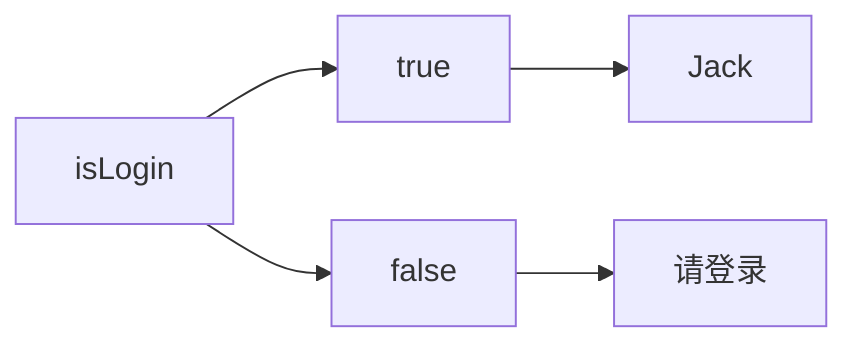

# 环境准备
## 创建工程
React浏览器开发插件：`React Developer Tools`
### webpack
create-react-app是一个快速创建React开发环境的工具，底层由Webpack构件，封装了配置细节，开箱即用
CMD执行命令：`npx create-react-app 工程文件名`

### Vite
CMD执行命令：`npm create vite@latest react-typescript -- --template react-ts`
## 路径解析配置
### webpack-js
配置步骤：

1. 安装craco：`npm i -D @craco/craco`
2. 项目根目录下创建配置文件：`craco.config.js`
3. 配置文件中添加路径解析配置
```javascript
const path = require('path')

module.exports = {
    // webpack配置
    webpack: {
        // 配置别名
        alias: {
            // 约定：使用@表示src 文件所在路径
            '@': path.resolve(__dirname, 'src/'),
        },
    },
}
```

4. 包文件中配置启动和打包命令
```json
"scripts": {
    "start": "craco start",
    "build": "craco build"
}
```
### Vite-ts
```typescript
import { defineConfig } from 'vite'
import react from '@vitejs/plugin-react'
import path from 'path'

// https://vitejs.dev/config/
export default defineConfig({
    plugins: [react()],
    resolve: {
        alias: {
            '@': path.resolve(__dirname, './src'),
        },
    },
})
```
## 联想路径配置
### webpack-js
配置步骤：

1. 根目录下新增配置文件 - jsconfig.json
2. 添加路径提示配置
```json
{
    "compilerOptions": {
        "baseUrl": "./",
        "paths": {
            "@/*": ["src/*"]
        }
    }
}
```
### Vite-ts
安装node类型包：`npm i @types/node -D`
```json
{
    "baseUrl": ".",
    "paths": {
        "@/*": [
            "src/*"
        ]
    },
}
```
# React基础
## JSX基础
JSX是JavaScript和XMl(HTML)的缩写，表示在JS代码中编写HTML模版结构，它是React中构建UI的方式。
```jsx
const message = 'this is message'

function App(){
    return (
        <div>
            <h1>this is title</h1>
            {message}
        </div>
    )
}
```
优势：

1. HTML的声明式模版写法
2. JavaScript的可编程能力
### 本质
JSX不是标准的JS语法，它是JS的语法扩展，浏览器本身不能识别，需要通过解析工具做解析之后才能在浏览器中使用


### JS表达式
```jsx
const message = "this is message"
function App() {
    return (
        <div>
            {/* 使用引号传递字符串 */}
            {"This is a div!"}
            {/* 使用JS变量 */}
            {message}
            {/* 函数调用 */}
            {getMessage()}
            {/* 方法调用 */}
            {new Date().toString()}
            {/* 使用JS对象 */}
            <div style={{ color: "red" }}>This is a div!</div>
        </div>
    );
}

export default App;
```
### 列表渲染


在JSX中可以使用原生js中的`map方法`实现列表渲染。

```jsx
const list = [
    {id:1001, name:'Vue'},
    {id:1002, name: 'React'},
    {id:1003, name: 'Angular'}
]

function App() {
    return (
        {/* 列表渲染 */}
        <ul>
            {list.map((item) => (
                <li key={item.id}>{item.name}</li>
            ))}
        </ul>
    )
}
```
> `key={item.id}`能够优化渲染速度

### 条件渲染
逻辑运算符与三目运算符



```jsx
const flag = true
const loading = false

function App(){
  return (
    <>
      {/* 逻辑 */}
      {flag && <span>this is span</span>}
      {/* 三目 */}
      {loading ? <span>loading...</span>:<span>this is span</span>}
      {isLogin ? <span>Jack</span>:<span>请登录</span>}
    </>
  )
}
```
### 复杂条件渲染
`if……else` `if……else`
```jsx
const type = 1  // 0|1|3

function getArticleJSX(){
  if(type === 0){
    return <div>无图模式模版</div>
  }else if(type === 1){
    return <div>单图模式模版</div>
  }else{
    return <div>三图模式模版</div>
  }
}

function App(){
  return (
    <>
      { getArticleJSX() }
    </>
  )
}
```
## 事件绑定
### 基本用法
React中的事件绑定，通过语法 `on + 事件名称 = { 事件处理程序 }`，整体上遵循驼峰命名法。
```jsx
function App(){
  // 这个方法写在App()的内外都可以
  const clickHandler = ()=>{
    console.log('button按钮点击了')
  }
  return (
    <button onClick={clickHandler}>click me</button>
  )
}
```
### 事件参数
在事件回调函数中设置形参`e`即可（名字随意，e、eve、event都可以）
```jsx
function App(){
  const clickHandler = (e)=>{
    console.log('button按钮点击了', e)
  }
  return (
    <button onClick={clickHandler}>click me</button>
  )
}
```
> 这里的 `e` 是一个 **合成事件对象**
>
> - **跨浏览器兼容性**：它封装了不同浏览器之间原生事件的差异，确保你的代码在各种浏览器中行为一致。
> - **性能优化**：React 会对事件对象进行“事件池”管理。事件处理函数执行完毕后，合成事件对象会被重新放回池中，而不是每次都创建新的，从而提高性能。这意味着，如果你需要异步访问 `e` 的属性，你需要调用 `e.persist()`，否则 `e` 的属性可能会被重置为 `null`。
> - **提供了与原生事件相同的接口**：虽然是合成的，但它提供了与原生 DOM 事件对象相似的属性和方法，例如 `e.target`（触发事件的 DOM 元素）、`e.currentTarget`（事件绑定的 DOM 元素）、`e.preventDefault()`（阻止默认行为）、`e.stopPropagation()`（阻止事件冒泡）等。

### 自定义参数

事件绑定的位置改造成箭头函数的写法，在执行`clickHandler`实际处理业务函数的时候传递实参。
```jsx
function App(){
  const clickHandler = (name)=>{
    console.log('button按钮点击了，姓名为', name)
  }
  return (
    <button onClick={()=>clickHandler('jack')}>click me</button>
  )
}
```
> [!important]
>
> 不能直接写函数调用，因为事件绑定需要一个函数引用！
>
> 当你写 `onClick={clickHandler('jack')}` 时，`clickHandler('jack')` 会**立即执行**。这意味着在组件渲染的时候，`clickHandler` 函数就会被调用，并且它的返回值（在本例中是 `undefined`，因为 `clickHandler` 没有显式返回任何东西）会被赋值给 `onClick` 属性。这样一来，当你点击按钮时，实际上就没有函数可以被调用了。
>
> 可以把 `onClick={clickHandler('jack')}` 想象成：
>
> 1. 组件渲染。
> 2. `clickHandler('jack')` 被执行。
> 3. `console.log('button按钮点击了，姓名为', 'jack')` 会立即打印到控制台。
> 4. `onClick` 属性的值现在是 `undefined`。
> 5. 当你点击按钮时，没有任何事情发生。

### 同时传递事件对象和自定义参数
在事件绑定的位置传递事件实参`e`和自定义参数，`clickHandler`中声明形参，**注意顺序对应。**
```jsx
function App(){
  const clickHandler = (name,e)=>{
    console.log('button按钮点击了，姓名：', name,e)
  }
  return (
    <button onClick={(e)=>clickHandler('jack',e)}>click me</button>
  )
}
```
## 组件基础
一个组件就是一个用户界面的一部分，它可以有自己的逻辑和外观，组件之间可以互相嵌套，也可以复用多次


### 基本使用
一个组件就是**首字母大写的函数**，内部存放了组件的逻辑和视图UI, 渲染组件只需要把组件当成标签书写即可
### 状态管理
#### 基础使用
`useState` 是一个 React Hook（函数），它允许我们向组件添加一个`状态变量`, 从而控制影响组件的渲染结果。

和普通JS变量不同的是，状态变量一旦发生变化组件的视图UI也会跟着变化（数据驱动视图）


```jsx
import React from "react";
function App(){
    const [ count, setCount ] = React.useState(0)
    return (
        <div>
            <button onClick={() => setCount(count + 1)}>{count}</button>
        </div>
    )
}
```
#### 状态修改规则
状态被认为是只读的，我们应该始终**替换它而不是修改它**, 直接修改状态不能引发视图更新


```jsx
const [count, setCount] = React.useState(0);
const handlerClick = () => {
    setCount(count + 1);
};
```
#### 修改对象状态
对于对象类型的状态变量，应该始终给set方法一个**全新的对象**来进行修改


```jsx
const [form, setForm] = useState({
    name: "Jack",
});
const handleChangeName = () => {
    setForm({
        ...form,	// ...用于创建对象的浅拷贝，它可以复制对象中的所有可枚举属性到新对象中
        name: "John",
    });
};
```
### 基础样式处理
#### 行内样式
```jsx
const style = {
    color: "red",
    fontSize: "20px"	// 注意要写成 驼峰形式
};

function App() {
    return (
        <div>
            {/* 行内样式控制 */}
            <div style={{ fontSize: "25px", color: "green" }}>this is div tag</div>
            <span style={style}>This is span tag</span>
        </div>
    );
}
```
#### class类名控制
```css
.foo {
    color: blue;
    font-size: 22px;
}
```
```jsx
import "./index.css";

function App() {
    return (
        <div>
            {/* 通过class类名控制样式 */}
            <span className="foo">This is class foo</span>
        </div>
    );
}
```
## 表单控制
### 受控绑定
在受控组件中，表单元素的值由 React 的 state 控制。当用户输入时，React 通过更新组件的 state 来反映输入的变化。受控组件中的值始终由 React 控制，并通过 props 将当前值传递给表单元素。


```jsx
import { useState } from "react";

function App() {
  	// 声明一个React状态
	const [value, setValue] = useState("");
	return (
		<input
			type="text"
			value={value}   // 通过value属性绑定react状态
      		// 绑定onChange事件 通过事件参数e拿到输入框最新的值
			onChange={(e) => setValue(e.target.value)}
		/>
	);
}
```
本例中，输入框的值受到 value 状态的控制，用户的输入会更新该状态，并且该状态的变化会被反映到输入框中。
### 非受控绑定
在非受控组件中，表单元素的值不受 React state 的控制，而是由 DOM 元素自身来管理。React 组件只是在需要时获取 DOM 元素的值，而不直接控制其值的变化。
```jsx
import { useRef } from "react";

function App() {
	// 生成ref对象，绑定到DOM标签上
	const inputRef = useRef(null);
	const onChange = () => {
		// DOM可用时，ref.current获取dom
		// 渲染完毕之后DOM生成之后才可用
		console.log(inputRef.current.value);
	};
	const handlerClick = () => {
		console.log(`Input value:${inputRef.current.value}`);
	};
	return (
		<div>
			<input type="text" ref={inputRef} onChange={onChange} />
			<button onClick={handlerClick}>Get Value</button>
		</div>
	);
}
```
## 组件通信
组件通信就是组件之间的数据传递, 根据组件嵌套关系的不同，有不同的通信手段和方法


| A-B 父子通信 | B-C 兄弟通信 | A-E 跨层通信 |
| :----------: | :----------: | :----------: |

### 父子通信——父传子

#### 基本用法

1. 父组件传递数据 - 在子组件标签上绑定属性
2. 子组件接收数据 - 子组件通过props参数接收数据
```jsx
function Son(props){
  return <div>从父组件接收到的：{ props.name }</div>
}

function App(){
  const name = 'this is app name'
  return (
    <div>
       <Son name={name}/>
    </div>
  )
}
```
#### props说明
**props可以传递任意的合法数据**，比如数字、字符串、布尔值、数组、对象、函数、JSX


**props是只读对象**，子组件只能读取props中的数据，不能直接进行修改, 父组件的数据只能由父组件修改

#### 特殊的prop-children
当把内容嵌套在组件的标签内部时，组件会自动在名为children的prop属性中接收该内容

```jsx
function Son(props) {
  console.log(props);
  return (
    <div>
      {props.children[1]}		{/* <b>!1this is b tag from father1!</b> */}
    </div>
  );
}

function App() {
  const appName = "this is app name";
  return (
    <div>
      <Son>
        <sub>!0this is sub tag from father0!</sub>
        <b>!1this is b tag from father1!</b>
      </Son>
    </div>
  );
}
```
### 父子通信——子传父


核心思路：在子组件中调用父组件中的函数并传递参数

```jsx
function Son({ onGetMsg }) {
	const sonMsg = "this is son msg";
	return (
		<div>
			{/* 在子组件中执行父组件传递过来的参数 */}
			<button onClick={() => onGetMsg(sonMsg)}>send msg to father</button>
		</div>
	);
}

function App() {
	const getMsg = (msg) => {
		console.log(msg);
	};
	return (
		<div>
			<Son onGetMsg={getMsg} />
		</div>
	);
}
```
### 兄弟通信


实现思路: 借助 **状态提升** 机制，通过共同的父组件进行兄弟之间的数据传递

1. A组件先通过子传父的方式把数据传递给父组件App
2. App拿到数据之后通过父传子的方式再传递给B组件
```jsx
// 1. 通过子传父 A -> App
// 2. 通过父传子 App -> B

import { useState } from "react";

function A({ onGetAName }) {
	// Son组件中的数据
	const name = "this is A name";
	return (
		<div>
			this is A compnent,
			<button onClick={() => onGetAName(name)}>send</button>
		</div>
	);
}

function B({ name }) {
	return (
		<div>
			this is B compnent,
			{name}
		</div>
	);
}

function App() {
	const [name, setName] = useState("");
	const getAName = (name) => {
		setName(name);
	};
	return (
		<div>
			this is App
			<A onGetAName={getAName} />
			<B name={name} />
		</div>
	);
}

export default App;
```

---

```jsx
import React, { useState } from 'react';
import SiblingA from './SiblingA';
import SiblingB from './SiblingB';

function ParentComponent() {
  const [name, setName] = useState('');

  return (
    <div>
      <SiblingA setName={setName} />
      <SiblingB name={name} />
    </div>
  );
}

export default ParentComponent;
```
```jsx
function SiblingA({ setName }) {
	const handleInputChange = (event) => {
		setName(event.target.value);
	};

	return (
		<div>
			<input
				type="text"
				placeholder="Enter name please"
				onChange={handleInputChange}
			/>
		</div>
	);
}

export default SiblingA;
```
```jsx
function SiblingB({ name }) {
	const handleButtonClick = () => {
		alert(`Hello SiblingB ${name} !`);
	};

	return (
		<div>
			<button onClick={handleButtonClick}>SiblingB Say Hello</button>
		</div>
	);
}

export default SiblingB;
```
### 跨组件通信


**实现步骤：**

1. 使用 `createContext`方法创建一个上下文对象Ctx
2. 在顶层组件（App）中通过 `Ctx.Provider` 组件提供数据
3. 在底层组件（B）中通过 `useContext` 钩子函数获取消费数据
```jsx
// 跨组件通信
// App -> A -> B

import { createContext, useContext } from "react";

// 1、createContext方法创建一个上下文对象
const MsgContext = createContext();

function A() {
    return (
        <div>
            this is A ParentComponent
            <B />
        </div>
    )
}

function B() {
    // 3、在底层组件通过useContext钩子函数使用数据
    const msg = useContext(MsgContext)
    return (
        <div>
            this is B component,{msg}
        </div>
    )
}

function App() {
    const msg = 'this is app msg'
    return (
        <div>
            {/* 2、在顶层组件通过Provider组件提供数据 */}
            <MsgContext.Provider value={msg}>
                this is App
                <A />
            </MsgContext.Provider>
        </div>
    )
}

export default App
```
### 总结
**组件间的关系**

- 父子组件
- 兄弟组件（非嵌套组件）
- 祖孙组件（跨级组件）

**通信方式**

- props
   - children props
   - render props
- 消息订阅-发布
   - pubs-sub、event……
- 集中式管理
   - redux、dva……
- conText
   - 生产者-消费者模式

**推荐的搭配方式**

- 父子组件：props
- 兄弟组件：消息订阅-发布、集中式管理
- 祖孙组件（跨级组件）：消息订阅-发布、集中式管理、conText(开发用得少，封装插件用得多)
## 副作用管理
### 概念
`useEffect`是一个React Hook函数，用于在React组件中创建不是由事件引起的，而是由渲染本身引起的操作（副作用）, 比如发送AJAX请求、手动更改真实DOM、设置订阅/启动定时器


### 基本使用
语法：`useEffect(() => {}, [])`

说明：

1. 参数1是一个函数，可以把它叫做副作用函数，在函数内部可以放置要执行的操作
2. 参数2是一个数组（可选参），在数组里放置依赖项，不同依赖项会影响第一个参数函数的执行，当是一个空数组的时候，副作用函数只会在组件渲染完毕之后执行一次
```jsx
useEffect(() => { 
  // 在此可以执行任何带副作用操作
  return () => { // 在组件卸载前执行
    // 在此做一些收尾工作, 比如清除定时器/取消订阅等
  }
}, [stateValue]) // 如果指定的是[], 回调函数只会在第一次render()后执行
```
```jsx
import { useEffect, useState } from "react";

function App() {
	const [count, setCount] = useState(0);

	// 每次渲染后更新文档标题
	useEffect(() => {
		document.title = `You have clicked ${count} times`;
	}, [count]); // 仅在 count 发生变化时重新运行

	return (
		<div>
			<p>You have clicked {count} times</p>
			<button onClick={() => setCount(count + 1)}>Click me</button>
		</div>
	);
}

export default App;
```
### 依赖说明
useEffect副作用函数的执行时机存在多种情况，根据传入依赖项的不同，会有不同的执行表现

| **依赖项** | **副作用函数的执行时机** |
| --- | --- |
| 没有依赖项 | 组件初始渲染 + 组件更新时执行 |
| 空数组依赖 | 只在初始渲染时执行一次 |
| 添加特定依赖项 | 组件初始渲染 + 依赖项变化时执行 |

### 清除副作用
在useEffect中编写的由渲染本身引起的对接组件外部的操作，社区也经常把它叫做副作用操作，比如在useEffect中开启了一个定时器，我们想在组件卸载时把这个定时器再清理掉，这个过程就是清理副作用


> 清除副作用的函数最常见的执行时机是在组件卸载时自动执行

```jsx
import { useEffect, useState } from "react";

function Son() {
	// 1. 渲染时开启一个定时器
	useEffect(() => {
		const timer = setInterval(() => {
			console.log("定时器执行中...");
		}, 1000);

		return () => {
			// 清除副作用(组件卸载时)
			clearInterval(timer);
		};
	}, []);
	return <div>this is son</div>;
}

function App() {
	// 通过条件渲染模拟组件卸载
	const [show, setShow] = useState(true);
	return (
		<div>
			{show && <Son />}
			<button onClick={() => setShow(false)}>卸载Son组件</button>
		</div>
	);
}

export default App;
```
## Hook函数

> [React 内置 Hook – React 中文文档](https://zh-hans.react.dev/reference/react/hooks)

### useReducer
`useReducer`用于管理组件的state。它类似于`redux`中的reducer概念,允许我们基于当前的state和指定操作(action),计算出新的state。`useReducer`提供了一种管理复杂state逻辑的优雅方式,特别是在需要共享状态逻辑或引用追踪的场景下非常有用。

#### 语法格式

```jsx
const [state, dispatch] = useReducer(reducer, initialState, init);
```

- `reducer`: 一个函数,接受当前state和action,返回新的state。
- `initialState`: 初始state。
- `init`: 可选的函数,用于延迟初始化state。
- `state`: 当前state。
- `dispatch`: 一个函数,用于触发state更新。


**为什么使用useReducer?**

1. **简化复杂state逻辑**：在组件中有多个state源,且需要复杂的逻辑来更新它们时,可以使用useReducer提供一个集中式的操作。
2. **重用逻辑**：reducer函数可在组件或hooks间共享。
3. **捕获引用值**：在某些场景下,reducer可以获取state前后变化的引用值,而通过`useState`则不能。
4. **更好的debug**：reducer总是返回全新的state,更容易观察state的变化。
```jsx
// 1. 定义reducer函数，根据不同的action状态返回不同的新状态
import {useReducer} from "react";

function reducer(state, action) {
    switch (action.type) {
        case 'INC':
            return {...state, count: state.count + 1};
        case 'DEC':
            return {...state, count: state.count - 1};
        case 'UPDATE':
            return {count: action.payload};
        default:
            return state.count;
    }
}

// 初始state
const initialState = {count: 0};

function App() {
    // 2. 使用useReducer分派action
    const [state, dispatch] = useReducer(reducer, initialState)
    return (
        <div>
            {/* 3. 调用dispatch函数传入action对象，触发reducer函数，分派action操作，使用新状态更新视图*/}
            <button onClick={() => dispatch({type: 'DEC'})}>-</button>
            {state.count}
            <button onClick={() => dispatch({type: 'INC'})}>+</button>
            <button onClick={() => dispatch({type: 'UPDATE', payload: 100})}>SET 100</button>
        </div>
    )
}

export default App
```
#### 对比useState
`useState`和`useReducer`都是React hooks中用于管理状态的钩子函数,但它们在使用场景和方式上存在一些差异:

**useState**:

- `useState`主要用于管理简单的状态,如字符串、数字、布尔值、对象或数组等。
- 每个状态只需要一个`setState`函数即可完成修改。
- 状态更新是直接覆盖原有状态。
- 状态逻辑相对简单直观。

**useReducer**:

- `useReducer`主要用于管理复杂的状态逻辑。
- 通过定义一个 reducer 函数集中处理多个状态的更新逻辑。
- 利用 action 对象描述不同的状态转换情况。
- 状态更新遵循纯函数式无副作用的模式,返回全新状态对象。
- 状态逻辑相对复杂,但更加结构化、可维护。
- 适合多个组件共享状态逻辑。

一般而言:

- 如果状态逻辑很简单,只有几个状态需要管理,使用`useState`即可。
- 如果有复杂的状态逻辑,多个子值需要共享逻辑、引用追踪等,使用`useReducer`会更加适合。
### useMemo
作用：缓存计算结果

语法：

```TSX
const memoizedValue = useMemo(() => computeExpensiveValue(a, b), [a, b]);
```

- `computeExpensiveValue(a, b)`: 你需要缓存的那个"昂贵"计算的函数,它应该是一个**纯函数**。
- `[a, b]`: 依赖数组,当a或b的值发生变化时,computeExpensiveValue(a, b)会重新执行。
```jsx
import React, {useMemo, useState} from 'react';

function fibonacci(n) {
    console.log('计算函数执行了！')
    if (n <= 1) return n;
    return fibonacci(n - 1) + fibonacci(n - 2);
}

function App() {
    const [number, setNumber] = useState(10);

    // 通过useMemo缓存计算结果，只有number发生变化时才重新计算
    const sum = useMemo(() => {
        return fibonacci(number)
    }, [number])

    return (
        <div>
            <label>
                Fibonacci of
                <input
                    type="number"
                    value={number}
                    onChange={(e) => setNumber(Number(e.target.value))}
                />
            </label>
            <p>Fibonacci({number}) = {sum}</p>
        </div>
    );
}

export default App
```
### useCallback
`useCallback` 是一个优化性能的 Hook。它用于缓存函数实例,避免在每次渲染时重新创建相同的函数。

*语法格式：*

```jsx
const memoizedCallback = useCallback(
  () => {
    // 函数体
  },
  [dependencies]
);
```

- 第一个参数是需要被缓存的函数。
- 第二个参数是依赖数组,当依赖项发生变化时,函数实例会被重新创建。

*使用场景:*

- 作为回调函数传递给子组件：如果一个回调函数作为`prop`传递给子组件,则应该使用`useCallback`对其进行缓存,以防止子组件不必要的重渲染。
- 在依赖项未发生变化时复用相同的函数实例：如果一个函数只依赖于某些状态或`props`,那么只有在依赖项发生变化时才需要重新创建函数实例。

*示例代码:*

```jsx
import { memo, useCallback, useState } from 'react'

const MemoSon = memo(function Son() {
    console.log('Son组件渲染了')
    return <div>this is son</div>
})

function App() {
    const [, forceUpdate] = useState()
    console.log('父组件重新渲染了')
    const onGetSonMessage = useCallback((message) => {
        console.log(message)
    }, [])

    return (
        <div>
            <MemoSon onGetSonMessage={onGetSonMessage} />
            <button onClick={() => forceUpdate(Math.random())}>update</button>
        </div>
    )
}

export default App
```
### useImperativeHandle
`useImperativeHandle` 是 React 提供的一个钩子,它可以与 `forwardRef` 一起使用,允许父组件获取子组件内部的一些命令或方法,从而控制子组件的行为。

> [!important]
>
> 在React 19 中，forawrdRef已经过时了，请使用ref

**语法格式：**

```jsx
useImperativeHandle(ref, createHandle, [deps])
```

- `ref` 是通过 `forwardRef` 传入的 ref 引用。
- `createHandle` 是一个函数,返回一个对象,该对象暴露给父组件访问和操作子组件的命令。
- `deps` 是一个可选的依赖数组,当依赖项变化时,`createHandle` 会重新执行。

**使用场景：**
通常情况下,React 推荐使用自上而下的数据流,通过传递 props 控制子组件。但在某些情况下,父组件需要直接访问子组件的内部方法或状态,这时就可以使用 `useImperativeHandle`。
**示例：**

```jsx
import React, { forwardRef, useImperativeHandle, useRef } from 'react';

const InputComponent = forwardRef((props, ref) => {
  // 实现内部的聚焦逻辑
  const inputRef = useRef(null);
  // 暴露子组件内部的聚焦方法 
  useImperativeHandle(ref, () => ({
    focus: () => {
      inputRef.current.focus();
    }
  }), []);

  return <input type="text" ref={inputRef} />;
});

const App = () => {
  const inputRef = useRef(null);

  const focusInput = () => {
    inputRef.current.focus();
  };

  return (
    <div>
      <InputComponent ref={inputRef} />
      <button onClick={focusInput}>Focus Input</button>
    </div>
  );
};
```
在这个例子中:

1. `InputComponent` 是一个子组件,通过 `forwardRef` 获取父组件传递的 ref 引用。
2. 在 `InputComponent` 内部,使用 `useImperativeHandle` 暴露了一个 `focus` 方法给父组件。
3. 父组件 `App` 通过 `inputRef.current` 可以访问到子组件暴露的 `focus` 方法。
4. 当点击按钮时,调用 `inputRef.current.focus()`  能够聚焦文本输入框。

### useDeferredValue

`useDeferredValue` 是一个性能优化 Hook，它允许你**延迟更新 UI 的一部分**。它的核心思想是“推迟”某个值的变化，直到其他更紧急、更高优先级的渲染完成。这使得你的应用在处理复杂或耗时的计算时，仍能保持主界面的响应性。

想象一下你有一个搜索框，用户每输入一个字，你就需要根据输入内容去过滤一个庞大的列表。如果每次输入都立即触发列表的重新过滤和渲染，UI 可能会卡顿。`useDeferredValue` 就能派上用场了。

**语法:**

```TSX
const currentValue = useDeferredValue(value, initialValue?)
```

**参数：**

- `value`: 你想延迟的值，可以是任何类型。
- **可选的** `initialValue`: 组件初始渲染时使用的值。如果省略此选项，`useDeferredValue` 在初始渲染期间不会延迟，因为没有以前的版本可以渲染。

**返回值：**

- `currentValue`: 在初始渲染期间，返回的延迟值是 `initialValue` 或你提供的值。在更新期间，React 首先尝试使用旧值重新渲染（因此返回旧值），然后在后台尝试使用新值重新渲染（因此返回更新后的值）。

**示例：**

```TSX
import React, { useState, useDeferredValue } from 'react';

// 一个模拟耗时渲染的组件
function ExpensiveList({ query }) {
  const items = React.useMemo(() => {
    console.log('--- 正在渲染耗时列表 ---', query);
    const list = [];
    for (let i = 0; i < 5000; i++) { // 模拟大量计算
      list.push(<li key={i}>{query} - Item {i}</li>);
    }
    return list;
  }, [query]); // 只有 query 变化时才重新渲染列表

  return <ul>{items}</ul>;
}

function SearchComponent() {
  const [inputValue, setInputValue] = useState('');
  // 使用 useDeferredValue 延迟 inputValue 的更新
  const deferredQuery = useDeferredValue(inputValue);

  const isPending = inputValue !== deferredQuery; // 判断是否处于延迟更新中

  return (
    <div>
      <input
        type="text"
        value={inputValue}
        onChange={(e) => setInputValue(e.target.value)}
        placeholder="快速输入，观察响应性"
        style={{ width: '300px', padding: '10px' }}
      />
      {isPending && <div style={{ color: 'gray' }}>Updating results...</div>} {/* 显示延迟提示 */}
      <hr />
      {/* 传递延迟后的值给耗时组件 */}
      <ExpensiveList query={deferredQuery} />
    </div>
  );
}

export default SearchComponent;
```

### useId

`useId()`可以生成传递给无障碍属性的唯一ID:

```TSX
const id = useId()
```

> [!important]
>
> **不要使用 `useId` 来生成列表中的 key**。[key 应该由你的数据生成](https://zh-hans.react.dev/learn/rendering-lists#where-to-get-your-key)。

### useLayoutEffect

`useLayoutEffect` 的语法与 `useEffect` 完全相同：

```TSX
useLayoutEffect(setup, dependencies?);
```

- `setup`：这是一个函数，包含你想要执行的副作用逻辑。它可以返回一个可选的清理函数（cleanup function）。
- `dependencies` (可选)：一个依赖项数组。只有当数组中的任何一个值发生变化时，`setup` 函数才会重新执行。

| 特性     | useLayoutEffect                                              | useEffect                                                    |
| -------- | ------------------------------------------------------------ | ------------------------------------------------------------ |
| 执行时机 | DOM 更新后，浏览器绘制前（同步执行，会阻塞浏览器绘制）       | DOM 更新后，浏览器绘制后（异步执行，不会阻塞浏览器绘制）     |
| 主用途   | 需要读取 DOM 布局信息（如元素尺寸、位置、滚动条）并同步修改 DOM，以避免视觉闪烁或不一致。 | 处理大多数副作用，如数据获取、订阅、设置定时器、日志记录等。不涉及 DOM 测量或需要同步修改 DOM 的场景。 |
| 用户体验 | 如果内部操作耗时，可能导致页面卡顿或闪烁，因为它会阻塞浏览器的绘制流程。 | 通常更流畅，因为它不会阻塞浏览器绘制，用户能更快看到 UI 响应。 |

### useOptimistic

用于实现**乐观 UI 更新**：即用户操作立即反映到界面上（假装操作已经成功），然后再等待实际异步操作完成后同步数据。

在实际开发中，经常需要这样一种体验：

> 用户点击“点赞”按钮 → UI 立即+1 → 然后再异步发送请求 → 请求成功后确认更新

如果不使用乐观更新，用户要等请求返回，UI 才更新，体验很差。

**基本语法**

```TSX
const [optimisticState, addOptimistic] = useOptimistic(state, updateFn);
```

**参数**

- `state`：初始时和没有挂起操作时要返回的值。
- `updateFn(currentState, optimisticValue)`：一个函数，接受当前 `state` 和传递给 `addOptimistic` 的乐观值，并返回结果乐观状态。它必须是一个纯函数。`updateFn` 接受两个参数：`currentState` 和 `optimisticValue`。返回值将是 `currentState` 和 `optimisticValue` 的合并值。

**返回值**

- `optimisticState`：结果乐观状态。除非有操作挂起，否则它等于 `state`，在这种情况下，它等于 `updateFn` 返回的值。
- `addOptimistic`：触发乐观更新时调用的 dispatch 函数。它接受一个可以是任何类型的参数 `optimisticValue`，并以 `state` 和 `optimisticValue` 作为参数来调用 `updateFn`。

### useTransition

`useTransition` 是一个 Hook，它允许你将某些状态更新标记为**“过渡（Transitions）”**。

- **紧急更新（Urgent Updates）**：用户交互相关的更新，比如输入框打字、点击按钮后的即时反馈，这些更新应该立即响应，保持 UI 的流畅性。
- **过渡更新（Transition Updates）**：非紧急的更新，例如在输入框输入后，根据输入内容过滤一个大型列表，或者点击一个选项卡后加载新数据。这些操作可能需要一些时间，如果立即处理，可能会导致 UI 卡顿。

`useTransition` 的核心思想：**让 React 知道哪些状态更新可以放在后台执行，不阻塞用户的紧急交互。** 当一个过渡更新正在进行时，它不会阻止浏览器响应其他紧急更新（比如用户的输入），从而保持应用的响应性。

#### 基本语法

```TSX
const [isPending, startTransition] = useTransition()
```

`useTransition` 没有参数，返回一个包含两个元素的数组：

1. **`isPending`** (boolean): 一个布尔值，指示当前是否有**待处理的过渡更新**。
2. **`startTransition`** (function): 一个函数，你用来**包裹**你想要标记为过渡的状态更新。

#### useTransition示例

```TSX
import React, { useState, useTransition } from 'react';

function MyComponent() {
  const [isPending, startTransition] = useTransition(); // 获取 isPending 状态和 startTransition 函数
  const [inputValue, setInputValue] = useState(''); // 紧急状态：用于输入框
  const [displayValue, setDisplayValue] = useState(''); // 过渡状态：用于显示搜索结果等耗时操作

  const handleChange = (e) => {
    // 1. 紧急更新：立即更新输入框的值，保持响应
    setInputValue(e.target.value);

    // 2. 过渡更新：将耗时的操作包裹在 startTransition 中
    startTransition(() => {
      // 在这里执行可能耗时的状态更新，React 会将其视为低优先级
      setDisplayValue(e.target.value);
    });
  };

  return (
    <div>
      <input
        type="text"
        value={inputValue} // 绑定到紧急状态，保证输入流畅
        onChange={handleChange}
        placeholder="快速输入，观察性能..."
      />
      {isPending && <div style={{ color: 'gray' }}>Loading results...</div>} {/* 当有过渡更新时显示加载状态 */}
      <hr />
      {/* displayValue 的更新可能滞后于 inputValue，但不会阻塞输入 */}
      <ComplexDisplay value={displayValue} />
    </div>
  );
}

// 模拟一个渲染开销较大的组件
function ComplexDisplay({ value }) {
  const items = React.useMemo(() => {
    console.log(`--- Rendering ComplexDisplay for: "${value}" ---`);
    const list = [];
    for (let i = 0; i < 10000; i++) { // 模拟大量计算
      list.push(<li key={i}>{value} - Item {i}</li>);
    }
    return list;
  }, [value]);

  return (
    <div>
      <h3>Displaying: "{value}"</h3>
      <ul>{items}</ul>
    </div>
  );
}
```

在上面的 `SearchComponent` 例子中：

1. 用户在 `<input>` 中打字：
   - `setInputValue(e.target.value)` 是一个**紧急更新**。输入框会立即响应，保持流畅的打字体验。
2. `startTransition(() => { setDisplayValue(e.target.value); })` 是一个**过渡更新**：
   - `setDisplayValue` 会触发 `ComplexDisplay` 组件的重新渲染，而这个组件模拟了一个耗时的操作。
   - 由于它被包裹在 `startTransition` 中，React 会将这个更新视为非紧急。
   - 如果用户在 `ComplexDisplay` 还在渲染旧值时继续快速打字，新的 `setInputValue` 会被优先处理，而 `ComplexDisplay` 的渲染可能会被中断或延迟，以确保输入框的响应性。
   - `isPending` 状态会在过渡开始时变为 `true`，并在过渡完成时变为 `false`，你可以用它来显示一个加载指示器，告诉用户后台有操作正在进行。

#### 对比useDeferredValue

`useDeferredValue` 和 `useTransition` 都是 React 为了解决「**慢数据导致的卡顿**」问题引入的**并发特性 Hook**。

| Hook               | 作用                                                       |
| ------------------ | ---------------------------------------------------------- |
| `useDeferredValue` | 推迟某个值的更新，让 UI 先更新其他更重要的部分，减少卡顿。 |
| `useTransition`    | 把某个状态更新标记为“低优先级”，UI可先响应，后台慢慢更新。 |

| 特点           | `useDeferredValue`                   | `useTransition`                             |
| -------------- | ------------------------------------ | ------------------------------------------- |
| 用于           | **值** 的延迟                        | **状态更新函数** 的延迟                     |
| 本质           | **“值” 的延迟读取**                  | **“更新” 的延迟执行**                       |
| 用途           | 大型搜索结果延迟渲染、惰性组件加载等 | 表单输入、选项切换后触发慢查询等            |
| 是否手动触发   | 否，自动推迟值                       | 是，必须用 `startTransition()` 包裹更新逻辑 |
| 是否控制优先级 | 否                                   | 是，标记为「低优先级」更新                  |

| 适用场景                                       | 推荐使用             |
| ---------------------------------------------- | -------------------- |
| 输入搜索时，搜索框要流畅、搜索结果慢点没关系   | ✅ `useTransition`    |
| 点击筛选器，筛选项立即变化，但筛选结果慢点也行 | ✅ `useTransition`    |
| 渲染大型组件树或图表，用户滑动或交互时卡顿     | ✅ `useDeferredValue` |

#### useOptimistic与useTransition联合示例

**目标场景：**

1. 用户输入评论
2. 点击发送后，**评论立即出现在列表中**
3. 真实评论发送完毕后，乐观数据被替换

```tsx
import { useState, useTransition, useOptimistic } from 'react';

// 评论数据类型定义
type Comment = {
    id: number;         // 评论唯一标识
    content: string;     // 评论内容
    isPending?: boolean; // 是否正在提交中（乐观更新标记）
};

// 模拟提交评论到服务器的函数
function postCommentToServer(content: string): Promise<Comment> {
    return new Promise(resolve => {
        setTimeout(() => {
            resolve({ id: Date.now(), content }); // 返回带时间戳ID的评论
        }, 2000); // 模拟网络延迟
    });
}

export default function CommentBox() {
    const [commentText, setCommentText] = useState(''); // 输入框内容状态
    const [comments, setComments] = useState<Comment[]>([]); // 服务器确认的评论列表
    const [isPending, startTransition] = useTransition(); // 过渡更新相关状态

    // 使用乐观更新hook创建本地即时显示的评论列表
    const [optimisticComments, addOptimisticComment] = useOptimistic(
        comments, // 基础状态
        (state, newComment: Comment) => [...state, newComment] // 更新函数
    );

    const handleSubmit = async () => {
        // 创建临时评论对象（带pending状态）
        const tempComment: Comment = {
            id: Date.now(), // 使用时间戳作为临时ID
            content: commentText,
            isPending: true, // 标记为待提交状态
        };

        addOptimisticComment(tempComment); // 立即显示乐观评论
        setCommentText(''); // 清空输入框

        // 在过渡中执行实际提交
        startTransition(async () => {
            const realComment = await postCommentToServer(tempComment.content);
            setComments(prev => [...prev, realComment]); // 更新服务器确认的评论
        });
    };

    return (
        <div>
            <h3>评论</h3>
            <input
                value={commentText}
                onChange={e => setCommentText(e.target.value)}
                placeholder="写下你的评论..."
            />
            {/* 提交按钮（在提交中或空内容时禁用） */}
            <button onClick={handleSubmit} disabled={isPending || !commentText.trim()}>
                发送
            </button>
            {/* 评论列表（包含乐观更新和服务器确认的评论） */}
            <ul>
                {optimisticComments.map(comment => (
                    <li key={comment.id}>
                        {comment.content}
                        {/* 显示提交中状态 */}
                        {comment.isPending && <span style={{ color: 'gray' }}>（发送中...）</span>}
                    </li>
                ))}
            </ul>
        </div>
    );
}
```

### 自定义Hook

自定义Hook必须是以 `use`**开头的函数**，通过自定义Hook函数可以用来**实现逻辑的封装和复用**


```jsx
// 问题: 布尔切换的逻辑 当前组件耦合在一起的 不方便复用
// 解决思路: 自定义hook

import { useState } from "react";

function useToggle() {
	// 可复用的逻辑代码
	const [value, setValue] = useState(true);

	const toggle = () => setValue(!value);

	// 哪些状态和回调函数需要在其他组件中使用，就return
	return {
		value,
		toggle,
	};
}

// 封装自定义hook通用思路
// 1、声明一个以use开头的函数
// 2、在函数体内封装可复用的逻辑（只要是可复用的逻辑）
// 3、把组件中用到的状态或者回调return出去
// 4、在哪个组件中要用到这个逻辑，就执行这个函数，解构出来状态和回调进行使用

function App() {
	const { value, toggle } = useToggle();
	return (
		<div>
			{value && <div>this is div</div>}
			<button onClick={toggle}>toggle</button>
		</div>
	);
}

export default App;
```
使用规则

1. 只能在组件中或者其他自定义Hook函数中调用
2. 只能在组件的顶层调用，不能嵌套在if、for、其它的函数中

## 组件

### `<Fragment>`/`<>...</>`

#### 问题引入

在 React 中，每个组件的 `render` 方法或函数组件的返回值**必须只有一个根元素**。例如，你不能直接返回两个并列的 `<div>`：

```TSX
// 错误示例：不能返回多个根元素
function MyComponent() {
  return (
    <div>第一个 div</div>
    <div>第二个 div</div> // 这样写会报错
  );
}
```

为了解决这个问题，你通常会把它们包裹在一个额外的 `div` 中：

```TSX
// 传统做法：用一个额外的 div 包裹
function MyComponent() {
  return (
    <div>
      <div>第一个 div</div>
      <div>第二个 div</div>
    </div>
  );
}
```

但是，这种做法会引入一个额外的、不必要的 DOM 节点到你的 HTML 结构中。这可能会：

1. **增加 DOM 深度**：在某些情况下，过深的 DOM 树会影响性能。
2. **影响布局**：额外的 `div` 可能会干扰 CSS 布局，尤其是在使用 Flexbox 或 Grid 时。

`React.Fragment` 就是为了解决这个问题而生的。它允许你将多个子元素组合在一起，而**不会在 DOM 中创建额外的节点**。

**`<Fragment>`特点：**

- **不渲染额外的 DOM 元素**：这是它最大的优势。它只是一个逻辑上的分组，不会在最终的 HTML 输出中生成 `<div>` 或其他标签。
- **可以有 `key` 属性（当使用完整语法时）**：如果你在一个列表渲染中使用 `Fragment`，并且需要为每个 `Fragment` 提供一个 `key`，那么你必须使用完整的 `<React.Fragment key={item.id}>` 语法。
- **支持 JSX 的所有子元素类型**：你可以将任何合法的 React 元素、字符串、数字等作为其子元素。

#### 使用方式

1. 完整语法：`<React.Fragment>`

> 使用时机：当你需要给 `Fragment` 添加 **`key` 属性**时（通常在渲染列表时）。

```TSX
function ItemsList({ items }) {
  return (
    <>
      {items.map(item => (
        <React.Fragment key={item.id}> {/* 必须使用完整语法来添加 key */}
          <li>{item.name}</li>
          <p>{item.description}</p>
        </React.Fragment>
      ))}
    </>
  );
}
```

2. 简写形式:`<></>`

```TSX
function MyComponent() {
  return (
    <>
      <h2>标题</h2>
      <p>这是一个段落。</p>
      <span>这是另一个元素。</span>
    </>
  );
}
```

### `Profiler`

`<Profiler>` 允许你编程式测量 React 树的渲染性能。

可以把 `<Profiler>` 想象成一个“计时器”，它包裹住你想要测量性能的组件树。当包裹的组件渲染（或重新渲染）时，`<Profiler>` 会记录渲染时间，并把这些数据传递给你定义的一个回调函数。

#### 基本用法

1. 从 `react` 包中导入它。
2. 给它一个必需的 `id` prop，用于标识这个 Profiler 区域。
3. 给它一个必需的 `onRender` prop，这是一个回调函数，当被包裹的组件树完成一次“提交”（即渲染或重新渲染）时，React 会调用这个函数，并传入详细的性能数据。

```TSX
import React, { Profiler } from 'react';

// onRender 回调函数接收的参数
function onRenderCallback(
  id, // 字符串：Profiler 树的“id”
  phase, // "mount" (首次挂载) 或 "update" (后续更新)
  actualDuration, // number：本次更新中渲染自身及子代所花费的实际时间
  baseDuration, // number：在不使用记忆化的情况下，渲染自身及子代所花费的估计时间
  startTime, // number：本次更新中 React 开始渲染的时间
  commitTime, // number：本次更新中 React 提交更新的时间
  interactions // Set：本次更新中包含的“interactions”（例如事件）
) {
  // 在这里处理性能数据
  console.log(`Profiler ID: ${id}`);
  console.log(`Phase: ${phase}`);
  console.log(`Actual Duration: ${actualDuration.toFixed(2)}ms`);
  console.log(`Base Duration: ${baseDuration.toFixed(2)}ms`);
  // 可以根据需要打印更多数据或发送到性能监控服务
}

function App() {
  return (
    <div>
      <h1>我的应用</h1>
      {/* 使用 Profiler 包裹你想要测量的组件树 */}
      <Profiler id="MySection" onRender={onRenderCallback}>
        <ExpensiveComponent />
        <OptimizedComponent />
      </Profiler>
      <Profiler id="AnotherSection" onRender={onRenderCallback}>
        <AnotherExpensiveComponent />
      </Profiler>
    </div>
  );
}
```

#### `OnRender`的参数

`onRender` 回调函数接收的参数：

- **`id`**: 这是一个字符串，你在 `<Profiler>` 组件上定义的 `id` prop，用于标识你正在测量哪个部分。
- **`phase`**:
  - `"mount"`：表示组件树是首次被挂载（渲染到 DOM）时触发的。
  - `"update"`：表示组件树是由于 `state` 或 `props` 变化而重新渲染时触发的。
- **`actualDuration`**: **本次更新中渲染自身及其子代组件所花费的实际时间（毫秒）**。这是你最应该关注的指标之一，它反映了实际的渲染性能。
- **`baseDuration`**: **在不使用任何记忆化优化的情况下，渲染自身及其子代组件所花费的估计时间（毫秒）**。这个值有助于你评估记忆化（如 `React.memo`, `useMemo`, `useCallback`）带来的效果。如果 `actualDuration` 远小于 `baseDuration`，说明你的记忆化优化是有效的。
- **`startTime`**: React 开始渲染本次更新的时间戳。
- **`commitTime`**: React 提交本次更新到 DOM 的时间戳。
- **`interactions`**: 这是一个 `Set` 对象，包含了一组表示“交互”的对象。这是 React 团队用于追踪用户交互对渲染影响的实验性特性，通常用于更高级的性能追踪。

### `StrictMode`

`<StrictMode>` 帮助你在**开发过程中**尽早地发现组件中的常见错误。

#### 使用方法

你可以在应用的任何部分包裹 `<StrictMode>`。通常，为了全面检查，你会将其包裹在整个应用的根组件上。

~~~TSX
import React from 'react';
import ReactDOM from 'react-dom/client';
import App from './App'; // 你的根组件

const root = ReactDOM.createRoot(document.getElementById('root'));
root.render(
  // 将你的整个应用包裹在 StrictMode 中
  <React.StrictMode>
    <App />
  </React.StrictMode>
);
~~~

#### 主要作用

`<StrictMode>` 会为它的后代组件做以下检查和警告（仅限开发模式）：

1. **识别不安全的生命周期方法 (Identifying unsafe lifecycles)**:
   - 警告你在类组件中使用一些老的、不安全的生命周期方法（例如 `componentWillMount`、`componentWillReceiveProps`、`componentWillUpdate`）。这些方法在异步渲染模式下可能会导致问题。
2. **关于旧版字符串 ref 用法的警告 (Warning about legacy string ref API usage)**:
   - 警告你使用已被弃用的字符串 `ref` 用法（例如 `<div ref="myRef">`），推荐使用 `createRef` 或 `useRef`。
3. **关于废弃的 findDOMNode 用法的警告 (Warning about deprecated findDOMNode usage)**:
   - `findDOMNode` 是一种直接获取 DOM 节点的方法，但它通常会导致一些问题。StrictMode 会警告你使用它，并推荐使用 `ref`。
4. **检测意外的副作用 (Detecting unexpected side effects)**:
   - 这是 `<StrictMode>` 最重要的功能之一。它会**有意地双重调用（或多次调用）**某些函数（如组件的 `render` 方法、`useState` 的更新函数、`useEffect` 的 `setup` 和 `cleanup` 函数），以帮助你发现副作用。
   - 如果你的组件或 Hook 内部有不应该发生的副作用（例如在渲染阶段修改了外部变量或执行了不必要的网络请求），这种双重调用会让你更快地暴露和修复这些问题。
5. **检测遗留 Context API 的使用 (Detecting legacy context API)**:
   - 警告你使用旧版的 Context API，推荐使用新的 `React.createContext`。
6. **确保可变状态不会被意外修改 (Ensuring reusable state)**: (React 18 及更高版本)
   - 在并发模式下，React 可能会在内部多次挂载和卸载组件树。StrictMode 会帮助你检测组件在挂载、卸载、再挂载过程中是否正确处理了状态，例如 `useEffect` 的清理函数是否正确地清除了副作用。


### `Suspense`

`<Suspense>` 允许在子组件完成加载前展示后备方案。

#### 基本语法

`Suspense` 组件接受两个重要的 `props`：

1. **`fallback` (必需)**:
   - 这是一个 React 元素，它会在 `Suspense` 的子组件（或其深层子孙组件）处于等待状态时被渲染。
   - 你可以放任何有效的 React 元素作为 `fallback`，例如一个加载指示器（loading spinner）、骨架屏（skeleton screen）或简单的文本。
2. **`children`**:
   - 这是你希望在加载完成后渲染的组件树。

你可以使用 Suspense 边界包裹你应用的任何部分：

```TSX
<Suspense fallback={<Loading />}>
  <Albums />
</Suspense>
```

React 将展示 后备方案 直到  children  需要的所有代码和数据都加载完成。

#### 同时展示内容

默认情况下，Suspense 内部的整棵组件树都被视为一个单独的单元。例如，即使 **只有一个** 组件因等待数据而被挂起，Suspense 内部的整棵组件树中的 **所有** 的组件都将被替换为加载中指示器：

```TSX
<Suspense fallback={<Loading />}>
  <Biography />
  <Panel>
    <Albums />
  </Panel>
</Suspense>
```

当它们都准备好展示时，它们将一起出现。

#### 逐步加载内容

当一个组件被挂起时，最近的父级 `Suspense` 组件会展示后备方案。这允许你嵌套多个 `Suspense` 组件创建一个加载序列。每个 `Suspense` 边界的后备方案都会在下一级内容可用时填充。例如，你可以给专辑列表设置自己的后备方案

```TSX
<Suspense fallback={<BigSpinner />}>
  <Biography />
  <Suspense fallback={<AlbumsGlimmer />}>
    <Panel>
      <Albums />
    </Panel>
  </Suspense>
</Suspense>
```

调整之后，`Biography` 不需要“等待” `Albums` 加载完成就可以展示。

加载序列将会是：

1. 如果 `Biography` 没有加载完成，`BigSpinner` 会显示在整个内容区域的位置。
2. 一旦 `Biography` 加载完成，`BigSpinner` 会被内容替换。
3. 如果 `Albums` 没有加载完成，`AlbumsGlimmer` 会显示在 `Albums` 和它的父级 `Panel` 的位置。
4. 最后，一旦 `Albums` 加载完成，它会替换 `AlbumsGlimmer`。

## React API

- [`createContext`](https://zh-hans.react.dev/reference/react/createContext) API 可以创建一个 context，你可以将其提供给子组件，通常会与 [`useContext`](https://zh-hans.react.dev/reference/react/useContext) 一起配合使用。
- [`lazy`](https://zh-hans.react.dev/reference/react/lazy) 允许你延迟加载组件，直到该组件需要第一次被渲染。
- [`memo`](https://zh-hans.react.dev/reference/react/memo) 允许你在 props 没有变化的情况下跳过组件的重渲染。通常 [`useMemo`](https://zh-hans.react.dev/reference/react/useMemo) 与 [`useCallback`](https://zh-hans.react.dev/reference/react/useCallback) 会一起配合使用。
- [`startTransition`](https://zh-hans.react.dev/reference/react/startTransition) 允许你可以标记一个状态更新是不紧急的。类似于 [`useTransition`](https://zh-hans.react.dev/reference/react/useTransition)。
- [`act`](https://zh-hans.react.dev/reference/react/act) 允许你在测试中包装渲染和交互，以确保在断言之前已完成更新。

### lazy

`React.lazy` 允许你定义一个组件，这个组件的**代码只有在它第一次被渲染时才会被加载**。这意味着，直到用户实际需要看到这个组件时，浏览器才会下载它对应的 JavaScript 代码。

你可以把 `React.lazy` 想象成一个“动态导入器”：它不会在应用启动时一次性加载所有组件的代码，而是等待你明确地指示它“现在需要这个组件了”，它才会去下载相应的代码。

#### 问题引入

在传统的单页应用 (SPA) 中，所有的 JavaScript 代码通常会被打包成一个或几个大的文件。当用户首次访问应用时，即使他们只看到了一小部分界面，浏览器也可能需要下载整个应用的 JavaScript 包。这会导致：

1. **初始加载时间过长**：用户等待时间变长，影响用户体验。
2. **不必要的资源浪费**：下载了用户可能永远不会用到的代码。

`React.lazy` 解决了这些问题，它允许你：

- **减少初始加载大小**：将应用拆分成更小的代码块（chunks），只在需要时加载，从而加快应用的启动速度。
- **优化用户体验**：让用户更快地看到应用的主界面，而不是长时间的白屏。
- **实现按需加载**：例如，只有当用户点击某个按钮或导航到特定路由时，才加载对应的组件代码。

#### 使用方法

> [!important]
>
> `React.lazy` 必须与 **`<Suspense>` 组件** 结合使用。

1. **定义懒加载组件**： `React.lazy` 接受一个函数作为参数。这个函数会返回一个 `import()` 语句，该语句会动态加载一个包含 React 组件的模块。

```TSX
import React, { lazy } from 'react';

// MyComponent 的代码只会在它第一次被渲染时加载
const MyComponent = lazy(() => import('./MyComponent'));
```

**`import('./MyComponent')`**：这是一个动态 `import()` 表达式，它会返回一个 Promise。当这个 Promise 解析时，它会得到一个模块对象，该模块对象的 `default` 属性就是你导出的 React 组件。

2. **渲染懒加载组件**： 当你使用 `React.lazy` 定义的组件时，必须将其包裹在 **`<Suspense>`** 组件内部。`<Suspense>` 组件需要一个 `fallback` prop，它定义了在组件代码加载完成之前显示的内容（例如，一个加载指示器或骨架屏）。

```TSX
import React, { Suspense, lazy } from 'react';

const MyLazyComponent = lazy(() => import('./MyLazyComponent'));
const AnotherLazyComponent = lazy(() => import('./AnotherLazyComponent'));

function App() {
  return (
    <div>
      <h1>我的应用</h1>
      <Suspense fallback={<div>Loading MyLazyComponent...</div>}>
        <MyLazyComponent />
      </Suspense>

      <hr />

      <Suspense fallback={<h2>Loading another section...</h2>}>
        <AnotherLazyComponent />
        {/* 你可以在同一个 Suspense 中包含多个懒加载组件 */}
      </Suspense>
    </div>
  );
}

export default App;
```

#### 注意事项

| 限制                                      | 说明                                |
| ----------------------------------------- | ----------------------------------- |
| 只适用于默认导出的组件                    | 懒加载文件必须使用 `export default` |
| 必须包裹在 `<Suspense>` 内部              | 否则会抛出运行时错误                |
| 不能和 `server-side rendering (SSR)` 混用 | React.lazy 不能直接用于服务端渲染   |

`React.lazy` 目前只支持默认导出。如果你想懒加载一个命名导出，你可以创建一个中间模块来重新导出它作为默认导出：

```TSX
// utils.js
export function NamedExportedComponent() { /* ... */ }

// MyNamedLazyComponent.js (中间文件)
import { NamedExportedComponent } from './utils';
export default NamedExportedComponent;

// App.js
const MyNamedLazyComponent = lazy(() => import('./MyNamedLazyComponent'));
```

### memo

作用：允许组件在props没有改变的情况下跳过重新渲染
memo 是一个高阶组件(HOC),它用于包裹 React 组件,用于优化组件的渲染性能。memo 会缓存组件的渲染结果,当组件的 props 发生变化时,才会重新渲染组件,否则就直接复用上一次的渲染结果。

**语法格式**

```jsx
import React, { memo } from 'react';

const MyComponent = memo(function MyComponent(props) {
  /* 使用 props 渲染组件 */
});
```
```jsx
const MyComponent = memo(
  React.memo(function MyComponent(props) {
    /* 使用 props 渲染组件 */
  }),
  (prevProps, nextProps) => {
    /* 自定义比较函数，比较新旧 props 是否相等 */
    /* 如果返回 true，则组件不会重新渲染 */
    /* 如果返回 false，则组件将重新渲染 */
  }
);
```
**使用场景**

- 当组件的渲染代价很高时，可以使用 `memo` 包裹组件，避免不必要的重渲染。
- 当组件是一个纯组件(Pure Component)时，即组件的输出只依赖于 `props` 的变化。
- 当组件被频繁重渲染时，使用 `memo` 可以减少不必要的重渲染。

**注意事项**

- memo 只会对组件的 props 进行浅层比较,如果 props 中包含了复杂对象或数组,只有引用发生变化时才会触发重渲染,对象或数组内部数据的变化不会触发重渲染。
- memo 不会比较组件的 state,因此如果组件的渲染依赖于 state,使用 memo 也不会阻止组件重渲染。
- memo 不应该用于函数组件中的每一个渲染,这可能会导致意外的重渲染。通常只需要为大型组件或高开销的子组件使用 memo。
- memo 只是一种性能优化的方式,并不是必需的,也不能滥用。
#### 对比`useMemo()`

| 名称         | 一句话解释                                                  |
| ------------ | ----------------------------------------------------------- |
| `useMemo`    | 缓存函数组件内部的**计算结果**，避免每次渲染都重新计算。    |
| `React.memo` | 缓存整个**函数组件的渲染结果**，避免 props 不变时重复渲染。 |

| 对比点     | `useMemo`                        | `React.memo`                                            |
| ---------- | -------------------------------- | ------------------------------------------------------- |
| 类型       | Hook（只能在函数组件中使用）     | 高阶组件（HOC）                                         |
| 缓存的内容 | 某个**值/计算结果**              | 整个**组件的渲染结果**                                  |
| 用途       | 避免内部重复计算，如大数组过滤等 | 避免不必要的组件重新渲染                                |
| 依赖项     | 传入依赖数组 `[dep1, dep2, ...]` | 自动对 `props` 进行浅比较，可配合 `areEqual` 自定义比较 |
| 适合场景   | 重计算代价大的逻辑               | 父组件频繁更新，子组件 props 不变                       |

| 场景                                      | 建议使用       |
| ----------------------------------------- | -------------- |
| 大型计算逻辑                              | `useMemo`      |
| 子组件 props 不变时避免重新渲染           | `React.memo`   |
| 两者一起用：父组件频繁更新 + 子组件耗性能 | ✅ 推荐组合使用 |

#### 组件默认的渲染机制

默认机制：顶层组件发生重新渲染，这个组件树的子级组件都会被重新渲染
```jsx
import { useState } from 'react'

function Son() {
  console.log('子组件被重新渲染了')
  return <div>this is son</div>
}

function App() {
  const [, forceUpdate] = useState()
  console.log('父组件重新渲染了')
  return (
    <>
      <Son />
      <button onClick={() => forceUpdate(Math.random())}>update</button>
    </>
  )
}

export default App
```
#### 使用React.memo优化
机制：只有props发生变化时才重新渲染
下面的子组件通过 memo 进行包裹之后，返回一个新的组件MemoSon, 只有传给MemoSon的props参数发生变化时才会重新渲染
```jsx
import { memo, useState } from 'react'

const MemoSon = memo(function Son() {
  console.log('子组件被重新渲染了')
  return <div>this is span</div>
})

function App() {
  const [, forceUpdate] = useState()
  console.log('父组件重新渲染了')
  return (
    <>
      <MemoSon />
      <button onClick={() => forceUpdate(Math.random())}>update</button>
    </>
  )
}

export default App
```
#### props的比较机制
| 基本类型 | 对象/复杂/引用类型 |
| --- | --- |
| 比较数值  | 比较引用 |

```jsx
import {memo, useState} from "react";

const MemoSon = memo(function Son({num, list}) {
    console.log('子组件被重新渲染了！')
    return (
        <div>
            this is Son!{num}.{list}
        </div>
    )
})

function App() {
    console.log('父组件重新渲染了!')
    const [, forceUpdate] = useState()
    const [num, setNum] = useState(100)
    const list = [1,3,5]
    return (
        <div>
            <MemoSon num={num} list={list}/>
            <button onClick={() => setNum(111)}>update</button>
            <button onClick={() => forceUpdate(Math.random())}>update</button>
        </div>
    )
}

export default App;
```
上面的例子中给子组件传入了基本类型`num`和引用类型`list`

- 第一个按钮修改了`num`的值，故子组件会重新渲染
- 第二个按钮没有修改`list`的值，但是因为组件App俩次渲染生成了不同的对象引用list，所以传给MemoSon组件的props视为不同，子组件也会发生重新渲染
#### 自定义比较函数
如果上一小节的例子，我们不想通过引用来比较，而是完全比较数组的成员是否完全一致，则可以通过自定义比较函数来实现
```jsx
import React, { useState } from 'react'

// 自定义比较函数
function arePropsEqual(oldProps, newProps) {
  console.log(oldProps, newProps)
  return (
    oldProps.list.length === newProps.list.length &&
    oldProps.list.every((oldItem, index) => {
      const newItem = newProps.list[index]
      console.log(newItem, oldItem)
      return oldItem === newItem
    })
  )
}

const MemoSon = React.memo(function Son() {
  console.log('子组件被重新渲染了')
  return <div>this is span</div>
}, arePropsEqual)

function App() {
  console.log('父组件重新渲染了')
  const [list, setList] = useState([1, 2, 3])
  return (
    <>
      <MemoSon list={list} />
      <button onClick={() => setList([1, 2, 3])}>
        内容一样{JSON.stringify(list)}
      </button>
      <button onClick={() => setList([4, 5, 6])}>
        内容不一样{JSON.stringify(list)}
      </button>
    </>
  )
}

export default App
```

### startTransition

#### 使用方法

`startTransition` 可以让你在后台渲染 UI 的一部分

```TSX
startTransition(action)
```

`startTransition` 函数可以将 state 更新标记为 transition:

```TSX
import { startTransition } from 'react';

function TabContainer() {
  const [tab, setTab] = useState('about');

  function selectTab(nextTab) {
    startTransition(() => {
      setTab(nextTab);
    });
  }
  // ...
}
```

**参数**

- `action`：调用一个或多个 [`set` 函数](https://zh-hans.react.dev/reference/react/useState#setstate) 来更新 state 的函数。React 会立即调用没有参数的 `action`，并将在 `action` 函数调用期间，调度所有的 state，并将同步更新标记为 transition。任何在 `action` 中等待的异步调用都将包含在 transition 中，但是目前需要将 `await` 之后的任何 `set` 函数包装在 `startTransition` 中 (查看 [故障排除](https://zh-hans.react.dev/reference/react/useTransition#react-doesnt-treat-my-state-update-after-await-as-a-transition) 了解更多)。被标记为 Transitions 的状态更新是 [非阻塞的](https://zh-hans.react.dev/reference/react/startTransition#marking-a-state-update-as-a-non-blocking-transition)，并且 [不会显示不想要的加载提示](https://zh-hans.react.dev/reference/react/useTransition#preventing-unwanted-loading-indicators)。

**返回值**

`startTransition` 不返回任何内容。

**注意事项**

- `startTransition` 没有提供一种跟踪 Transition 是否处于待定状态的方法。为了在 Transition 进行时显示一个待定状态的指示器，你需要使用 [`useTransition`](https://zh-hans.react.dev/reference/react/useTransition)。
- 只有当你能访问某个 state 的 `set` 函数时，你才能将它的更新包裹到 Transition 中。如果你想根据 props 或自定义 Hook 的返回值来启动一个 transition，请尝试使用 [`useDeferredValue`](https://zh-hans.react.dev/reference/react/useDeferredValue)。
- 你传递给 `startTransition` 的函数会立即被调用，并将其执行时发生的所有状态更新标记为 Transitions。如果你试图在 `setTimeout` 中进行状态更新，它们将不会被标记为 Transitions。
- You must wrap any state updates after any async requests in another `startTransition` to mark them as Transitions. This is a known limitation that we will fix in the future (see [Troubleshooting](https://zh-hans.react.dev/reference/react/useTransition#react-doesnt-treat-my-state-update-after-await-as-a-transition)).
- 一个被标记为 Transition 的 state 更新时将会被其他 state 更新打断。例如，如果你在 Transition 内部更新图表组件，但在图表重新渲染时在输入框中打字，则 React 将先处理输入 state 更新，之后才会重新启动对图表组件的渲染工作。
- Transition 更新不能用于控制文本输入。
- 如果有多个正在进行的 transition，目前 React 会将它们集中在一起处理。这是一个限制，在未来的版本中可能会被移除。

#### 对比useTransition

| 特性               | `startTransition`        | `useTransition`                      |
| ------------------ | ------------------------ | ------------------------------------ |
| 类型               | 函数                     | Hook                                 |
| 使用场景           | 函数组件外部或异步逻辑中 | 在组件内部需要显示“加载中”状态时使用 |
| 是否可追踪加载状态 | ❌ 无状态跟踪             | ✅ 提供 `isPending` 可判断加载状态    |

### CreteContext

使用 `createContext` 创建组件能够提供与读取的 [上下文（context）](https://zh-hans.react.dev/learn/passing-data-deeply-with-context)。

```TSX
const SomeContext = createContext(defaultValue)
```

### use

`use(promise)` 让你在组件中“像同步写法一样”使用异步数据，**React 会自动 suspend（挂起）组件，直到 Promise 解析完毕**。

#### 问题引入

在 `use` Hook 出现之前，处理 React 组件中的异步数据通常涉及以下几种模式：

1. **`useEffect` + `useState`**：这是最常见的模式，但在处理加载、错误状态和取消请求时，会引入大量的样板代码和复杂性。

```TSX
function OldWay() {
  const [data, setData] = useState(null);
  const [loading, setLoading] = useState(true);
  const [error, setError] = useState(null);

  useEffect(() => {
    let ignore = false;
    async function fetchData() {
      setLoading(true);
      try {
        const response = await fetch('/api/data');
        const result = await response.json();
        if (!ignore) {
          setData(result);
        }
      } catch (err) {
        if (!ignore) {
          setError(err);
        }
      } finally {
        if (!ignore) {
          setLoading(false);
        }
      }
    }
    fetchData();
    return () => { ignore = true; };
  }, []);

  if (loading) return <div>Loading...</div>;
  if (error) return <div>Error: {error.message}</div>;
  return <div>Data: {JSON.stringify(data)}</div>;
}
```

这种方式需要手动管理加载、错误状态，并且在组件卸载时进行清理以避免内存泄漏。

2. **第三方数据获取库**：如 React Query (TanStack Query), SWR, Apollo Client 等。这些库提供了更高级的抽象，但引入了额外的依赖和学习曲线。

`use`的目标是简化这种模式，将异步操作的处理更紧密地集成到 React 的渲染生命周期中，并利用 **Suspense** 来管理加载状态。

#### 基本用法

`use` Hook 可以用于读取：

1. **Promise 的值**
2. **Context 的值** (行为类似于 `useContext`)

##### 读取 Promise 

当你在组件内部调用 `use(promise)` 时：

- 如果 Promise 还没有解析（处于 pending 状态），React 会**暂停（suspend）**该组件的渲染。
- React 会查找组件树上方最近的 `<Suspense>` 边界，并渲染其 `fallback` prop 定义的 UI。
- 一旦 Promise 解析（fulfilled 状态），React 会使用解析后的值重新尝试渲染组件。
- 如果 Promise 被拒绝（rejected 状态），React 会向上抛出错误，最近的 **错误边界 (Error Boundary)** 会捕获并处理这个错误。

```TSX
import React, { Suspense, ErrorBoundary, use } from 'react';

// 模拟一个异步数据获取函数
function fetchData(id) {
  return new Promise(resolve => {
    setTimeout(() => {
      resolve({ id: id, name: `Item ${id}`, description: `Details for item ${id}` });
    }, 1000); // 模拟网络延迟
  });
}

// 模拟一个错误的数据获取函数
function fetchErrorData() {
  return new Promise((_, reject) => {
    setTimeout(() => {
      reject(new Error('Failed to load data!'));
    }, 1000);
  });
}

// 带有 use Hook 的数据展示组件
function ItemDisplay({ itemId }) {
  // 直接在组件内部使用 use() 来“等待” Promise 的解析
  const item = use(fetchData(itemId)); // 当 Promise pending 时，组件会 suspend

  return (
    <div>
      <h2>Item: {item.name}</h2>
      <p>ID: {item.id}</p>
      <p>{item.description}</p>
    </div>
  );
}

// 错误组件示例
function ErrorItemDisplay() {
  const errorResult = use(fetchErrorData()); // 这个 Promise 会拒绝
  return <div>This should not be rendered if there's an error. {JSON.stringify(errorResult)}</div>;
}

// 应用结构
function App() {
  const [itemId, setItemId] = React.useState(1);

  return (
    <div>
      <h1>React 19 `use` Hook 示例</h1>
      <button onClick={() => setItemId(prev => prev === 1 ? 2 : 1)}>
        切换 Item (ID: {itemId === 1 ? 2 : 1})
      </button>
      <hr />

      {/* 使用 Suspense 包裹可能暂停的组件 */}
      <Suspense fallback={<div>Loading Item...</div>}>
        <ItemDisplay itemId={itemId} />
      </Suspense>

      <hr />

      {/* 使用 ErrorBoundary 包裹可能抛出错误的组件 */}
      <ErrorBoundary fallback={<div>Error loading item! Please try again.</div>}>
        <Suspense fallback={<div>Loading Error Demo...</div>}>
          <ErrorItemDisplay />
        </Suspense>
      </ErrorBoundary>
    </div>
  );
}

// ErrorBoundary 组件 (需要自己实现或使用库)
class ErrorBoundary extends React.Component {
  constructor(props) {
    super(props);
    this.state = { hasError: false, error: null };
  }

  static getDerivedStateFromError(error) {
    return { hasError: true, error: error };
  }

  componentDidCatch(error, errorInfo) {
    console.error("Caught an error in ErrorBoundary:", error, errorInfo);
  }

  render() {
    if (this.state.hasError) {
      return this.props.fallback;
    }
    return this.props.children;
  }
}
export default App;
```

**关键点：**

- `use` Hook 必须在 **支持 Suspense 的组件** 中使用（函数组件顶层或自定义 Hook 内部）。
- 它将数据获取和组件渲染更紧密地结合在一起，消除了许多 `useEffect` 和 `useState` 组合带来的状态管理复杂性。
- 它**强制**你使用 Suspense 和错误边界来管理加载和错误状态，这是 React 并发模式的范式。

##### 读取 Context

`use` Hook 也可以用来读取 Context 的值。当它用于读取 Context 时，它的行为与 `useContext` 类似，但它在处理某些边界情况（例如 Context 更新）时可能提供不同的语义，尽管在大部分日常使用中，你可能仍然会选择 `useContext`。

```TSX
import React, { createContext, use } from 'react';

const ThemeContext = createContext('light');

function ThemedComponent() {
  // 使用 use Hook 读取 Context 值
  const theme = use(ThemeContext); // 行为类似于 useContext(ThemeContext)

  return (
    <div style={{ background: theme === 'dark' ? 'black' : 'white', color: theme === 'dark' ? 'white' : 'black' }}>
      Current theme: {theme}
    </div>
  );
}

function App() {
  return (
    <ThemeContext.Provider value="dark">
      <ThemedComponent />
    </ThemeContext.Provider>
  );
}
```


## Class API

> 类式组件已过时！！！[Component – React 中文文档](https://zh-hans.react.dev/reference/react/Component)

### 基础体验
```jsx
// class API
import { Component } from 'react'

class Counter extends Component {
  // 状态变量
  state = {
    count: 0,
  }

  // 事件回调
  clickHandler = () => {
    // 修改状态变量 触发UI组件渲染
    this.setState({
      count: this.state.count + 1,
    })
  }

  // UI模版
  render() {
    return <button onClick={this.clickHandler}>+{this.state.count}</button>
  }
}

function App() {
  return (
    <div>
      <Counter />
    </div>
  )
}

export default App
```
### 生命周期

### 组件通信
#### 父传子
```jsx
// class API
import { Component } from 'react'

class Son extends Component {
  render() {
    const { count } = this.props
    return <div>this is Son, {count}</div>
  }
}

class App extends Component {
  // 状态变量
  state = {
    count: 0,
  }

  setCount = () => {
    this.setState({
      count: this.state.count + 1,
    })
  }

  // UI模版
  render() {
    return (
      <>
        <Son count={this.state.count} />
        <button onClick={this.setCount}>+</button>
      </>
    )
  }
}

export default App
```
#### 子传父
```jsx
// class API
import { Component } from 'react'

class Son extends Component {
  render() {
    const { msg, onGetSonMsg } = this.props
    return (
      <>
        <div>this is Son, {msg}</div>
        <button onClick={() => onGetSonMsg('this is son msg')}>
          changeMsg
        </button>
      </>
    )
  }
}

class App extends Component {
  // 状态变量
  state = {
    msg: 'this is initail app msg',
  }

  onGetSonMsg = (msg) => {
    this.setState({ msg })
  }

  // UI模版
  render() {
    return (
      <>
        <Son msg={this.state.msg} onGetSonMsg={this.onGetSonMsg} />
      </>
    )
  }
}

export default App
```

## 工具库

### lodush

[Lodash 简介 | Lodash中文文档 | Lodash中文网](https://www.lodashjs.com/)
Lodash 是一个 JavaScript 实用工具库，提供了许多实用的功能，帮助开发者在编写 JavaScript 代码时更高效、更方便。它提供了对数组、对象、函数、字符串等数据类型的处理方法，同时还提供了许多实用的工具函数，用于简化常见的编程任务。

```shell
npm install --save lodush
```

```jsx
import _ from 'lodash'
```

### classnames

`classnames` 是一个 JavaScript 工具库，用于动态生成 HTML 元素的 class 字符串。它通常在 React 应用程序中用于简化条件性地应用 CSS 类名。
`classnames` 可以更方便地处理动态 class 名称的拼接，特别是在有多个条件需要考虑时，代码会更加清晰和简洁。

1.  **安装**`classnames`：
    你可以使用 npm 或者 yarn 来安装 `classnames`： 

```bash
npm install classnames
```

2.  **基本用法**： 

```javascript
import classNames from 'classnames';

const buttonClass = classNames({
  'btn': true,
  'btn-primary': true,
  'btn-large': false
});

// buttonClass 的值为 'btn btn-primary'
```

在这个例子中，`classNames` 接受一个对象作为参数，对象的 key 是 class 名称，value 是一个布尔值，表示是否应该包含该 class。`classNames` 会将 value 为 true 的 class 名称添加到最终的 class 字符串中。 

3.  **条件性应用 class**： 

```javascript
import classNames from 'classnames';

const active = true;
const buttonClass = classNames('btn', {
  'btn-primary': active,
  'btn-large': !active
});

// buttonClass 的值为 'btn btn-primary'
```

本例中，`btn` class 总会被添加，而 `btn-primary` 或 `btn-large` 则根据 `active` 变量的值进行条件性添加。

4.  **数组作为参数**： 

```javascript
import classNames from 'classnames';

const size = 'small';
const buttonClass = classNames('btn', ['btn-primary', 'btn-large'], {
  'btn-small': size === 'small',
  'btn-medium': size === 'medium',
  'btn-large': size === 'large'
});

// 如果 size 为 'small'，则 buttonClass 的值为 'btn btn-primary btn-large btn-small'
```

本例展示了如何将数组作为参数传递给 `classnames`，数组中的每个元素都会被添加到最终的 class 字符串中。 

### UUID

[GitHub - uuidjs/uuid: Generate RFC-compliant UUIDs in JavaScript](https://github.com/uuidjs/uuid)

```shell
npm install uuid
```

```javascript
import { v4 as uuidv4 } from 'uuid';
uuidv4(); // ⇨ '9b1deb4d-3b7d-4bad-9bdd-2b0d7b3dcb6d'
```

### days

[Day.js中文网](https://dayjs.fenxianglu.cn/)
处理日期时间

# React&TypeScript

## useState
### 简单场景
> 简单场景下，可以使用TS的自动推断机制，不用特殊编写类型注解，运行良好

```typescript
const [val, toggle] = React.useState(false)

// `val` 会被自动推断为布尔类型
// `toggle` 方法调用时只能传入布尔类型
```
### 复杂场景
> 复杂数据类型，useState支持通过`泛型参数`指定初始参数类型以及setter函数的入参类型

```typescript
type User = {
  name: string
  age: number
}
const [user, setUser] = React.useState<User>({
  name: 'jack',
  age: 18
})
// 执行setUser
setUser(newUser)
// 这里newUser对象只能是User类型
```
### 无默认值
> 实际开发时，有些时候useState的初始值可能为null或者undefined，按照泛型的写法是不能通过类型校验的，此时可以通过完整的类型联合null或者undefined类型即可

```typescript
type User = {
  name: string
  age: number
}
const [user, setUser] = React.useState<User>(null)
// 上面会类型错误，因为null并不能分配给User类型

const [user, setUser] = React.useState<User | null>(null)
// 上面既可以在初始值设置为null，同时满足setter函数setUser的参数可以是具体的User类型

return (
  <div>
  {user?.name} {user?.age}
  </div>
)
```
## useRef
在TypeScript环境下，`useRef` 函数返回一个`只读` 或者 `可变` 的引用
只读的场景：常见于获取真实dom；
可变的场景：常见于缓存一些数据，不跟随组件渲染；

### 获取DOM
> 获取DOM时，通过泛型参数指定具体的DOM元素类型即可

```tsx
function Foo() {
  // 尽可能提供一个具体的dom type, 可以帮助我们在用dom属性时有更明确的提示
  // divRef的类型为 RefObject<HTMLDivElement>
  const inputRef = useRef<HTMLDivElement>(null)

  useEffect(() => {
    inputRef.current.focus()
  })

  return <div ref={inputRef}>etc</div>
}
```
如果你可以确保`divRef.current` 不是null，也可以在传入初始值的位置
```typescript
// 添加非null标记
const divRef = useRef<HTMLDivElement>(null!)
// 不再需要检查`divRef.current` 是否为null
doSomethingWith(divRef.current)
```
### 稳定引用存储器
> 当作为可变存储容器使用的时候，可以通过`泛型参数`指定容器存入的数据类型, 在还未存入实际内容时通常把`null`作为初始值，所以依旧可以通过联合类型做指定

```tsx
interface User {
  age: number
}

function App(){
  const timerRef = useRef<number | undefined>(undefined)
  const userRes = useRef<User | null> (null)
  useEffect(()=>{
    timerRef.current = window.setInterval(()=>{
      console.log('测试')
    },1000)
    
    return ()=>clearInterval(timerRef.current)
  })
  return <div> this is app</div>
}
```
## Props
### 为Props添加类型
props作为React组件的参数入口，添加了类型之后可以限制参数输入以及在使用props有良好的类型提示

#### interface
```tsx
interface Props {
  className: string
}

export const Button = (props: Props)=>{
  const { className } = props
  return <button className={ className }>Test</button>
}
```
#### type
```tsx
type Props = {
  className: string
}

export const Button = (props: Props)=>{
  const { className } = props
  return <button className={ className }>Test</button>
}
```
### 为Props的children添加类型
> children属性和props中其他的属性不同，它是React系统中内置的，其它属性我们可以自由控制其类型，children属性的类型最好由React内置的类型提供，兼容多种类型

```tsx
type Props = {
  children: React.ReactNode
}

export const Button = (props: Props)=>{
   const { children } = props
   return <button>{ children }</button>
}
```
**说明：**React.ReactNode是一个React内置的联合类型，包括 `React.ReactElement` 、`string`、`numberReact.ReactFragment` 、`React.ReactPortal` 、`boolean`、 `null` 、`undefined`
### 为事件prop添加类型
```tsx
// 定义 Props 接口，用于描述 Son 组件的 props 结构
interface Props {
  // onGetMsg 是一个可选的回调函数，接收一个字符串参数，并没有返回值
  onGetMsg?: (msg: string) => void;
}

// 子组件 Son
function Son(props: Props) {
  // 从 props 中解构出 onGetMsg 方法
  const { onGetMsg } = props;

  // 点击事件处理函数
  const clickHandler = () => {
    // 调用父组件传递过来的 onGetMsg 方法，并传递字符串参数
    onGetMsg?.("this is message!");
  };

  // 返回一个按钮，点击按钮时触发 clickHandler 函数
  return <button onClick={clickHandler}>sendMsg</button>;
}

// 父组件 App
function App() {
  // 定义一个处理接收消息的函数，打印消息到控制台
  const getMsgHandler = (msg: string) => {
    console.log(msg);
  };

  // 返回两个 Son 组件，分别传递不同的 onGetMsg 回调函数
  return (
    <>
      {/* 传递一个内联函数作为 onGetMsg 回调 */}
      <Son onGetMsg={(msg) => console.log(msg)} />

      {/* 传递一个外部定义的函数作为 onGetMsg 回调 */}
      <Son onGetMsg={getMsgHandler} />
    </>
  );
}

export default App;
```
### 为事件handle添加类型
> 为事件回调添加类型约束需要使用React内置的泛型函数来做，比如最常见的鼠标点击事件和表单输入事件

```tsx
function App(){
  const changeHandler: React.ChangeEventHandler<HTMLInputElement> = (e)=>{
    console.log(e.target.value)
  }
  
  const clickHandler: React.MouseEventHandler<HTMLButtonElement> = (e)=>{
    console.log(e.target)
  }

  return (
    <>
      <input type="text" onChange={ changeHandler }/>
      <button onClick={ clickHandler }> click me!</button>
    </>
  )
}
```

